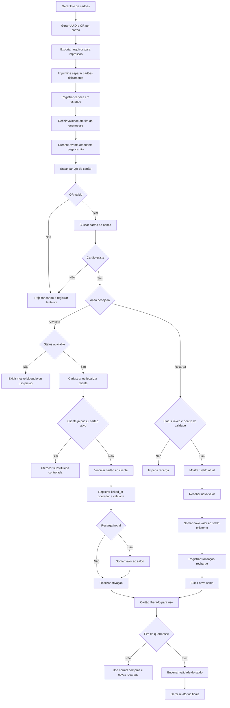

# Sistema de cartões pré-impressos para quermesse

## Objetivo deste documento

Este documento descreve, de forma técnica e operacional, como funcionaria um fluxo completo de cartões físicos pré-impressos com QR Code para uso na quermesse.

A proposta substitui o modelo atual em que o QR Code nasce no momento do cadastro por um modelo em que os cartões já existem fisicamente antes do evento, com QR Codes previamente gerados, impressos, controlados em estoque e vinculados ao cliente apenas quando forem entregues.

O objetivo é permitir uma decisão consciente sobre a implementação, considerando operação, banco de dados, interface, validações, riscos e impacto no código existente.

---

## 1. Visão geral da proposta

No modelo atual, o sistema cria o cartão junto com o cliente, como pode ser observado em [`createCard`](src/hooks/useCards.js:118), onde primeiro é criado o cliente e depois o registro em [`cards`](database/schema.sql:53). Além disso, o schema atual exige [`client_id`](database/schema.sql:56) obrigatório em [`cards`](database/schema.sql:53), o que impede a existência de cartões sem dono prévio.

No modelo proposto, o fluxo muda para:

1. Antes do evento, a organização gera um lote de cartões.
2. Cada cartão recebe um identificador único e um QR Code.
3. Os cartões são impressos e separados fisicamente.
4. No banco, esses cartões ficam em estoque, ainda sem cliente vinculado.
5. Durante o evento, o atendente pega um cartão físico disponível.
6. O cartão é escaneado.
7. O cliente é cadastrado ou identificado.
8. O cartão é vinculado ao cliente naquele momento.
9. O cliente pode ir ao caixa e adicionar saldo ao valor que já possui no cartão.
10. O saldo permanece válido até o fim da quermesse.
11. A partir daí, o cartão passa a operar normalmente para recarga, consulta, compra e transferência.

Em resumo, o QR Code deixa de ser consequência do cadastro e passa a ser um ativo físico previamente preparado.

---

## 2. Premissas operacionais adotadas neste documento

Para evitar ambiguidades, este documento assume as seguintes regras de negócio como recomendação principal:

- os cartões são pré-gerados antes do evento
- o cartão físico pode existir sem cliente vinculado
- o QR Code continua usando o padrão `QUERMESSE:{uuid}`
- o cliente pode adicionar saldo várias vezes no caixa
- o saldo acumulado permanece no cartão até o encerramento oficial da quermesse
- o saldo não precisa ser zerado entre recargas
- a validade do saldo é limitada ao período do evento
- a reutilização do cartão físico deve ser tratada apenas após o encerramento do evento ou após encerramento formal do ciclo daquele cartão
- durante a quermesse, o mesmo cliente pode continuar usando o mesmo cartão e apenas somar novas recargas ao saldo existente

Essa premissa muda um ponto importante da análise inicial: o foco da reutilização não é reaproveitar o cartão entre clientes durante o evento, e sim permitir que o mesmo cartão continue acumulando saldo até o fim da quermesse.

---

## 3. Comparação conceitual com o fluxo atual

## Fluxo atual

Hoje, o sistema está orientado a um cartão já associado a um cliente:

- [`cards.client_id`](database/schema.sql:56) é obrigatório
- existe restrição de um cartão por cliente em [`cards_one_per_client`](database/schema.sql:65)
- o formulário de criação em [`CardForm`](src/components/cards/CardForm.jsx:28) já pressupõe cadastro do cliente
- a listagem em [`CardList`](src/components/cards/CardList.jsx:35) assume que o cartão sempre terá [`client`](src/components/cards/CardList.jsx:59)
- a leitura em [`ScanCard`](src/pages/ScanCard.jsx:15) busca um cartão já existente e mostra seus detalhes
- a exibição do QR em [`QrDisplay`](src/components/qr/QrDisplay.jsx:29) está pensada como visualização de um cartão já ativo

## Fluxo proposto

No novo modelo, o cartão passa por dois ciclos:

1. ciclo logístico
   - geração
   - impressão
   - estoque
   - distribuição

2. ciclo operacional e financeiro
   - vinculação ao cliente
   - recarga inicial
   - recargas adicionais
   - consumo
   - bloqueio
   - substituição
   - encerramento ao fim da quermesse

Isso exige separar claramente:

- identidade física do cartão
- vínculo do cartão com um cliente
- estado operacional do cartão
- validade do saldo
- histórico financeiro do cartão
- histórico de uso físico do cartão

---

## 4. Antes do evento: preparação completa

## 4.1 Geração do lote de cartões

Antes do evento, um operador administrativo acessaria uma nova área de gestão de cartões pré-impressos.

Essa área permitiria:

- definir quantidade de cartões a gerar
- definir prefixo ou lote
- definir faixa numérica visual
- gerar UUID interno para cada cartão
- gerar payload do QR Code
- registrar data de geração
- registrar lote de impressão
- registrar operador responsável
- registrar validade operacional do lote até o fim da quermesse

### Exemplo de lote

- evento: Quermesse 2026
- lote: LOTE-A
- quantidade: 1000 cartões
- faixa visual: 000001 até 001000
- payload QR: `QUERMESSE:{uuid}`
- status inicial: disponível para impressão ou disponível em estoque
- validade do saldo: até encerramento da quermesse

### Recomendação técnica

Manter o payload do QR simples e estável:

```text
QUERMESSE:550e8400-e29b-41d4-a716-446655440000
```

Esse formato já é compatível com a validação atual em [`handleScanSuccess`](src/components/qr/QrScanner.jsx:55), dentro de [`QrScanner`](src/components/qr/QrScanner.jsx:17), que espera exatamente o padrão `QUERMESSE:{uuid}`.

### Campos recomendados por cartão no lote

Cada cartão pré-gerado deveria conter pelo menos:

- id interno
- uuid
- código visual curto
- lote_id
- event_id ou event_name
- status logístico
- status operacional
- saldo atual
- validade do saldo
- impresso_em
- vinculado_em
- client_id opcional
- blocked_reason opcional
- last_event_id opcional

---

## 4.2 Exportação para impressão

Após gerar o lote, o sistema precisaria oferecer exportação para impressão.

### Formatos recomendados

- PDF para gráfica ou impressão local
- CSV para integração com software externo de etiquetas
- PNG ou SVG por cartão, se houver impressão individual
- folha A4 com grade de cartões
- folha térmica, se houver impressora específica

### Conteúdo visual recomendado do cartão

Cada cartão físico pode conter:

- nome do evento
- QR Code
- código visual curto
- instruções rápidas
- aviso de não dobrar ou molhar
- informação de validade do saldo até o fim da quermesse
- espaço opcional para identificação manual
- telefone ou canal de suporte

### Exemplo de layout do cartão

Frente:
- logo da quermesse
- QR Code central
- código visual curto, por exemplo `QM-004281`
- frase `Use este cartão para recarga e compras`

Verso:
- instruções de uso
- aviso de guarda
- política de perda
- frase `Saldo válido até o encerramento da quermesse`
- campo opcional para nome do portador

### Recomendação de código visual

Além do UUID interno, imprimir um código curto humano-legível:

```text
QM-004281
```

Isso ajuda em:

- conferência manual
- suporte quando o QR estiver danificado
- auditoria física
- separação por lote

---

## 4.3 Quantidade recomendada

A quantidade depende do perfil do evento, mas uma regra prática pode ser:

- público esperado x taxa de adesão ao cartão x margem de segurança

### Exemplo

Se o evento espera 2000 pessoas e estima que 60 por cento usarão cartão:

- base estimada: 1200 cartões
- margem operacional de 20 a 30 por cento
- lote recomendado: 1500 a 1600 cartões

### Recomendações práticas

- evento pequeno: 300 a 500 cartões
- evento médio: 1000 a 2000 cartões
- evento grande: 3000 ou mais

### Separação física recomendada

Os cartões devem ser organizados por:

- lote
- faixa numérica
- status físico
- posto de atendimento

Exemplo:

- caixa 1: cartões 000001 a 000300
- caixa 2: cartões 000301 a 000600
- reserva técnica: cartões extras
- caixa de contingência: cartões para reposição

---

## 4.4 Armazenamento no banco de dados

O schema atual em [`cards`](database/schema.sql:53) não suporta bem esse fluxo porque:

- [`client_id`](database/schema.sql:56) é obrigatório
- existe unicidade de um cartão por cliente em [`cards_one_per_client`](database/schema.sql:65)
- o status atual só cobre `active`, `inactive` e `blocked` em [`cards_status_valid`](database/schema.sql:64)
- não há conceito de lote, impressão, estoque ou disponibilidade
- não há validade explícita do saldo por evento

### Duas opções de modelagem

## Opção recomendada: separar inventário físico de vínculo operacional

Criar uma nova estrutura para cartões pré-impressos, por exemplo:

- tabela de lotes
- tabela de cartões físicos
- tabela de vínculo ou uso atual
- tabela de configuração de validade por evento

### Exemplo conceitual

#### `card_batches`
Representa o lote gerado para impressão.

Campos:
- id
- name
- event_name
- quantity
- created_at
- generated_by
- print_status
- valid_until

#### `physical_cards`
Representa cada cartão físico.

Campos:
- id
- uuid
- visual_code
- batch_id
- physical_status
- operational_status
- client_id nullable
- linked_at nullable
- blocked_at nullable
- blocked_reason nullable
- balance
- valid_until
- last_used_at
- created_at
- updated_at

### Status sugeridos

#### Status físico
- generated
- printed
- in_stock
- delivered
- damaged
- discarded

#### Status operacional
- available
- linked
- blocked
- expired
- retired

## Opção incremental

Adaptar a tabela [`cards`](database/schema.sql:53) para aceitar `client_id` nulo e adicionar novos campos.

Essa opção é mais rápida, mas tende a misturar logística física com operação financeira. Para um fluxo robusto, a recomendação principal continua sendo separar melhor os conceitos.

---

## 5. Durante o evento: operação completa

## 5.1 Fluxo de cadastro do cliente com cartão físico

O fluxo operacional recomendado seria:

1. atendente pega um cartão físico ainda disponível
2. atendente abre tela de cadastro com vínculo de cartão
3. atendente escaneia o QR do cartão físico
4. sistema valida se o cartão existe e está disponível
5. atendente informa dados do cliente
6. sistema valida duplicidades e consistência
7. sistema vincula o cartão ao cliente
8. sistema confirma ativação
9. opcionalmente já oferece recarga inicial
10. em qualquer momento posterior, o cliente pode voltar ao caixa e adicionar mais saldo ao mesmo cartão
11. o novo valor é somado ao saldo já existente
12. esse saldo acumulado continua válido até o fim da quermesse

### Diferença central para o fluxo atual

Hoje, o formulário em [`CardForm`](src/components/cards/CardForm.jsx:28) cria cliente e cartão juntos. No novo fluxo, o cartão já existe. Portanto, o formulário deixaria de criar o cartão e passaria a:

- localizar cartão disponível
- cadastrar cliente
- vincular cliente ao cartão existente
- permitir recarga inicial ou posterior no mesmo cartão

---

## 5.2 Como escanear o cartão físico

O scanner atual em [`QrScanner`](src/components/qr/QrScanner.jsx:17) já resolve boa parte da leitura do QR.

Ele:

- abre câmera
- lê QR
- valida o padrão `QUERMESSE:{uuid}` em [`handleScanSuccess`](src/components/qr/QrScanner.jsx:55)
- retorna o UUID para o fluxo chamador

Isso significa que a leitura física do cartão já está parcialmente pronta.

### O que muda no comportamento

Hoje, a página [`ScanCard`](src/pages/ScanCard.jsx:15) interpreta o scan como busca de um cartão já operacional.

No novo fluxo, o mesmo scanner pode ser usado em três contextos:

1. consulta operacional
   - buscar cartão já vinculado
   - mostrar saldo e dados

2. ativação de cartão físico
   - buscar cartão disponível
   - validar se ainda não foi entregue
   - abrir formulário de vínculo

3. recarga no caixa
   - localizar cartão já vinculado
   - mostrar saldo atual
   - somar novo valor ao saldo existente
   - respeitar validade até o fim da quermesse

### Recomendação

Criar uma nova página específica, por exemplo:

- `CardActivation`
- `PrePrintedCardRegistration`
- `CardRechargeByScan`

Assim, a página [`ScanCard`](src/pages/ScanCard.jsx:15) continua focada em consulta, enquanto novas páginas cuidam da ativação e da recarga.

---

## 5.3 Validações necessárias no momento do scan

Ao escanear um cartão físico para ativação, consulta ou recarga, o sistema deve validar:

### Validação 1: formato do QR
Já existe em [`QrScanner`](src/components/qr/QrScanner.jsx:59).

Se falhar:
- mensagem: QR Code inválido
- ação: impedir continuidade

### Validação 2: UUID existe no banco
Se não existir:
- mensagem: cartão não cadastrado no lote oficial
- ação: bloquear uso

### Validação 3: cartão pertence ao evento atual
Se houver múltiplos eventos ou lotes:
- validar lote ativo
- impedir uso de cartão de evento antigo

### Validação 4: saldo ainda está dentro da validade
Como a regra definida é validade até o fim da quermesse, o sistema deve validar:

- data atual menor ou igual à data de encerramento do evento
- cartão não marcado como expirado

Se falhar:
- impedir novas compras
- impedir novas recargas, se essa for a política
- orientar encerramento ou prestação de contas

### Validação 5: status operacional é compatível com a ação
Exemplos:

- para ativação: status deve ser `available`
- para recarga: status deve ser `linked`
- para consulta: status pode ser `linked` ou `blocked`, conforme permissão
- para uso em compra: status deve ser `linked`

### Validação 6: cartão bloqueado
Se estiver bloqueado:
- impedir ativação
- impedir compra
- impedir recarga, salvo exceção administrativa
- exibir motivo

### Validação 7: cartão não está danificado ou descartado
Se status físico for inválido:
- impedir uso

### Validação 8: cliente não possui outro cartão ativo
Essa regra depende da política do evento.

Como o modelo atual impõe um cartão por cliente em [`cards_one_per_client`](database/schema.sql:65), o documento assume como padrão:

- um cliente só pode ter um cartão ativo por vez

Se o cliente já tiver cartão:
- oferecer localizar cartão existente
- oferecer transferência de saldo
- oferecer substituição controlada

### Validação 9: dados do cliente não duplicados
A lógica atual em [`createCard`](src/hooks/useCards.js:118) já tenta evitar duplicidade por CPF ou telefone.

No novo fluxo, essa validação continua necessária, mas deve ser desacoplada da criação do cartão.

---

## 5.4 Vinculação ao cliente

Após o scan e validações, o sistema executa:

1. criação ou identificação do cliente
2. atualização do cartão físico para status `linked`
3. preenchimento de `client_id`
4. gravação de `linked_at`
5. gravação do operador responsável
6. gravação do posto de atendimento
7. criação opcional de transação inicial de recarga
8. definição da validade do saldo até o fim da quermesse

### Exemplo prático

Cartão:
- visual code: QM-004281
- uuid: `550e8400-e29b-41d4-a716-446655440000`
- status antes: available

Cliente:
- nome: Maria Souza
- telefone: `(11) 99999-0000`

Após vínculo:
- status: linked
- client_id: 845
- linked_at: 2026-06-18 19:42
- balance: 0 ou valor da recarga inicial
- valid_until: encerramento da quermesse

---

## 5.5 Fluxo de recarga durante o evento

Esse é um ponto central da regra definida pelo usuário.

### Regra operacional

O cliente pode voltar ao caixa quantas vezes quiser durante a quermesse e adicionar saldo ao mesmo cartão.

O sistema deve:

1. localizar o cartão por scan
2. validar que o cartão está vinculado e ativo
3. mostrar saldo atual
4. receber novo valor de recarga
5. somar o novo valor ao saldo existente
6. registrar transação do tipo `recharge`
7. atualizar saldo final
8. manter validade até o fim da quermesse

### Exemplo prático

Situação inicial:
- saldo atual: R$ 35,00

Nova recarga:
- valor adicionado: R$ 20,00

Resultado:
- novo saldo: R$ 55,00

### Observação importante

Essa regra não é reutilização entre clientes. É continuidade de uso do mesmo cartão pelo mesmo cliente, com saldo acumulado até o encerramento do evento.

---

## 5.6 Casos especiais

## Caso A: cartão já usado

Situação:
- atendente escaneia cartão para ativação
- sistema encontra status `linked`

Resposta recomendada:
- bloquear nova vinculação
- informar que o cartão já está em uso
- mostrar código visual e data de vínculo
- permitir fluxo administrativo de substituição, se autorizado

## Caso B: cartão inválido

Situação:
- QR fora do padrão
- UUID inexistente
- lote não reconhecido

Resposta:
- impedir uso
- registrar tentativa
- orientar troca do cartão físico

## Caso C: cartão bloqueado

Situação:
- cartão marcado como bloqueado por perda, fraude ou erro

Resposta:
- impedir uso
- exibir motivo
- encaminhar para supervisor

## Caso D: cartão danificado

Situação:
- QR ilegível, mas código visual curto ainda existe

Resposta:
- permitir busca manual por código visual
- confirmar identidade do cartão
- decidir entre reimpressão, substituição ou descarte

## Caso E: cliente já possui cartão

Situação:
- CPF ou telefone já vinculado a outro cartão

Resposta recomendada:
- localizar cartão anterior
- oferecer transferência de saldo
- bloquear cartão antigo
- vincular novo cartão apenas em fluxo de substituição autorizado

## Caso F: saldo expirado após fim da quermesse

Situação:
- cliente tenta usar ou recarregar cartão após encerramento do evento

Resposta recomendada:
- impedir novas operações
- exibir mensagem de validade encerrada
- encaminhar para regra administrativa de fechamento

---

## 6. Gestão de cartões

## 6.1 Status dos cartões

Para o modelo pré-impresso, o status precisa ser mais rico do que o atual em [`cards_status_valid`](database/schema.sql:64).

### Status recomendados

#### Status operacional
- available
- linked
- blocked
- expired
- retired

#### Status físico
- generated
- printed
- in_stock
- delivered
- damaged
- discarded

### Interpretação

- `available`: cartão existe no estoque e pode ser entregue
- `linked`: cartão já pertence a um cliente
- `blocked`: cartão não pode operar
- `expired`: saldo e uso encerrados após fim da quermesse
- `retired`: cartão saiu definitivamente de circulação

- `generated`: criado no sistema, ainda não impresso
- `printed`: já foi impresso
- `in_stock`: está disponível fisicamente
- `delivered`: foi entregue ao atendimento ou cliente
- `damaged`: sofreu dano físico
- `discarded`: foi inutilizado

---

## 6.2 Reutilização de cartões

Com a regra definida, é importante separar dois conceitos:

### Continuidade de uso durante a quermesse
Esse é o comportamento principal:
- o mesmo cliente mantém o mesmo cartão
- o saldo pode ser aumentado no caixa
- o valor acumulado continua válido até o fim da quermesse

### Reutilização física do cartão
Esse é outro cenário:
- o cartão deixa de pertencer ao ciclo atual
- o evento termina ou o cartão é formalmente encerrado
- depois disso, o cartão pode ou não ser reaproveitado em outro ciclo

### Recomendação principal

Durante a quermesse:
- não reutilizar o mesmo cartão entre clientes diferentes sem fluxo administrativo formal

Após o encerramento:
- avaliar reaproveitamento físico do cartão apenas se houver política clara de reset operacional

### Pré-condições para reutilização física posterior

1. evento encerrado ou ciclo encerrado
2. saldo tratado conforme política de fechamento
3. cartão não bloqueado por fraude
4. cartão fisicamente íntegro
5. autorização administrativa
6. registro do motivo da reutilização

### Observação crítica

Como o saldo tem validade até o fim da quermesse, a reutilização entre clientes durante o evento é altamente sensível e não deve ser o fluxo padrão.

---

## 6.3 Transferência de saldo

A transferência de saldo continua relevante em cenários como:

- perda do cartão
- QR danificado
- substituição por erro de impressão
- troca por cartão novo

### Fluxo recomendado

1. localizar cartão antigo
2. validar identidade do cliente
3. bloquear cartão antigo
4. selecionar novo cartão disponível
5. vincular novo cartão ao mesmo cliente
6. transferir saldo
7. registrar transações `transfer_out` e `transfer_in`
8. manter auditoria do motivo

Os tipos `transfer_in` e `transfer_out` já existem em [`transactions`](database/schema.sql:157), o que favorece esse fluxo.

---

## 6.4 Relatórios de cartões

O sistema deveria oferecer relatórios específicos para cartões pré-impressos.

### Relatórios recomendados

#### Relatório de estoque
- total gerado
- total impresso
- total disponível
- total vinculado
- total bloqueado
- total expirado
- total descartado

#### Relatório por lote
- lote
- quantidade
- faixa visual
- taxa de ativação
- perdas
- danos
- cartões ainda com saldo
- cartões expirados

#### Relatório operacional
- cartões ativados por hora
- cartões ativados por posto
- cartões bloqueados
- cartões substituídos
- cartões com tentativa de uso inválido
- recargas por período

#### Relatório financeiro relacionado
- saldo total por cartões ativos
- saldo total ainda válido
- saldo expirado ao fim do evento
- saldo transferido
- cartões sem movimentação
- cartões com recarga inicial
- cartões com múltiplas recargas

---

## 7. Vantagens e desvantagens

## 7.1 Vantagens

### Operacionais
- atendimento mais rápido
- menor fila no cadastro
- menor dependência de geração em tempo real
- cartões já prontos para distribuição
- melhor contingência em ambiente com internet instável
- recarga simples no caixa usando o mesmo cartão

### Logísticas
- controle prévio de estoque
- distribuição por posto
- conferência física por lote
- reposição mais simples

### Experiência do usuário
- entrega imediata do cartão
- menos tempo de espera
- processo mais parecido com pulseira ou ficha física de evento
- cliente pode voltar ao caixa e apenas somar saldo ao que já possui

### Técnicas
- reaproveitamento parcial do scanner atual em [`QrScanner`](src/components/qr/QrScanner.jsx:17)
- manutenção do padrão de QR já usado em [`QrDisplay`](src/components/qr/QrDisplay.jsx:57)
- possibilidade de auditoria por lote

---

## 7.2 Desvantagens

### Complexidade de modelagem
- exige separar estoque físico de vínculo com cliente
- aumenta número de estados e validações
- exige novas telas administrativas
- exige controle de validade do saldo por evento

### Risco operacional
- cartões podem ser perdidos antes da entrega
- cartões podem ser trocados fisicamente
- QR pode ser danificado
- lote pode ser impresso com erro
- pode haver saldo remanescente no encerramento do evento

### Custo
- custo de impressão
- custo de logística
- custo de reposição
- custo de controle físico

### Impacto técnico
- schema atual não suporta bem o fluxo
- hooks atuais estão centrados em criação imediata de cartão
- componentes atuais assumem cartão sempre vinculado

---

## 7.3 Casos de uso ideais

Esse modelo é ideal quando:

- o evento tem alto volume de público
- há necessidade de atendimento rápido
- há múltiplos pontos de cadastro
- a operação precisa de contingência offline parcial
- a organização quer preparar tudo antes do evento
- o caixa precisa fazer recargas rápidas no mesmo cartão

---

## 7.4 Limitações

Esse modelo tem limitações quando:

- o evento é muito pequeno
- a operação não quer lidar com estoque físico
- há baixa previsibilidade de público
- o custo de impressão não compensa
- a equipe não consegue controlar bem distribuição e recolhimento
- não existe regra clara para encerramento do saldo ao fim da quermesse

---

## 8. Implementação técnica

## 8.1 Mudanças no banco de dados

O schema atual em [`cards`](database/schema.sql:53) precisaria mudar significativamente.

### Mudanças mínimas necessárias

#### Em `cards`
- permitir `client_id` nulo
- ampliar status
- adicionar campos de vínculo e bloqueio
- adicionar código visual
- adicionar referência de lote
- adicionar validade do saldo

### Mudanças recomendadas
Criar novas tabelas para separar responsabilidades.

#### Exemplo de estrutura recomendada

### `card_batches`
Responsável por lotes de geração e impressão.

Campos sugeridos:
- id
- name
- event_name
- quantity
- generated_by
- created_at
- print_exported_at
- valid_until
- notes

### `cards`
Pode continuar existindo, mas com papel redefinido como inventário físico-operacional.

Campos adicionais sugeridos:
- visual_code
- batch_id
- physical_status
- linked_at
- blocked_at
- blocked_reason
- valid_until
- expires_at
- event_name

### `card_events`
Tabela de auditoria operacional.

Campos sugeridos:
- id
- card_id
- event_type
- payload
- created_at
- operator_name

### Benefício dessa abordagem

- controle de validade por evento
- recarga acumulativa no mesmo cartão
- auditoria completa
- relatórios mais confiáveis
- separação entre histórico financeiro e histórico operacional

---

## 8.2 Modificações nos hooks

O hook atual [`useCards`](src/hooks/useCards.js:9) está centrado em CRUD tradicional de cartão já vinculado.

### Funções atuais impactadas

#### [`createCard`](src/hooks/useCards.js:118)
Hoje:
- cria cliente
- cria cartão

No novo modelo:
- não deve mais criar cartão físico do zero no cadastro comum
- deve virar algo como `linkCardToClient`
- ou coexistir com novas funções específicas

### Novas funções recomendadas

- `generateCardBatch`
- `fetchAvailableCards`
- `getCardByVisualCode`
- `linkPrePrintedCardToClient`
- `rechargeCardByScan`
- `expireEventCards`
- `blockCard`
- `replaceCard`
- `fetchCardInventory`
- `fetchCardBatchReport`

### Funções que precisariam ser adaptadas

- `fetchCards`
- `getCardByUuid`
- `getCardByClientId`
- `updateCard`

Especialmente porque hoje várias consultas assumem relacionamento obrigatório com [`clients`](database/schema.sql:23).

---

## 8.3 Modificações nos componentes

## Componentes atuais impactados

### [`CardForm`](src/components/cards/CardForm.jsx:28)
Hoje cria cliente e cartão juntos.

Precisaria ser dividido em dois modos:
- cadastro com cartão pré-existente
- edição de vínculo e dados do cliente

### [`CardList`](src/components/cards/CardList.jsx:35)
Hoje assume que todo cartão tem cliente.

Precisaria suportar:
- cartões disponíveis sem cliente
- filtros por lote
- filtros por status físico e operacional
- busca por código visual
- indicação de validade do saldo

### [`CardDetails`](src/components/cards/CardDetails.jsx:46)
Hoje mostra detalhes de cliente, saldo, QR e histórico.

Precisaria suportar:
- cartão sem cliente
- dados logísticos
- lote
- validade do saldo
- histórico de vínculo
- ações de bloqueio e substituição

### [`QrDisplay`](src/components/qr/QrDisplay.jsx:29)
Hoje exibe QR de cartão já operacional.

Poderia ganhar modo de impressão:
- QR sem dados do cliente
- layout para lote
- exportação em massa
- indicação de validade até o fim da quermesse

### [`QrScanner`](src/components/qr/QrScanner.jsx:17)
Pode ser reaproveitado quase integralmente.

A principal mudança seria no fluxo consumidor:
- consulta
- ativação
- recarga
- substituição
- auditoria

---

## 8.4 Novas páginas necessárias

### Página 1: gestão de lotes
Exemplo:
- `CardBatchManagement`

Funções:
- gerar lote
- listar lotes
- exportar impressão
- acompanhar status

### Página 2: ativação de cartão pré-impresso
Exemplo:
- `CardActivation`

Funções:
- escanear cartão
- validar disponibilidade
- cadastrar cliente
- vincular cartão
- recarga inicial opcional

### Página 3: inventário de cartões
Exemplo:
- `CardInventory`

Funções:
- listar cartões disponíveis
- filtrar por lote
- bloquear
- marcar danificado
- descartar
- controlar validade

### Página 4: recarga por leitura
Exemplo:
- `CardRecharge`

Funções:
- escanear cartão
- mostrar saldo atual
- adicionar novo valor
- registrar recarga
- exibir validade do saldo

### Página 5: substituição de cartão
Exemplo:
- `CardReplacement`

Funções:
- localizar cartão antigo
- transferir saldo
- bloquear antigo
- ativar novo

### Página 6: relatórios de cartões
Pode ser integrada a [`Reports`](src/pages/Reports.jsx) ou virar módulo próprio.

---

## 8.5 Impacto nas rotas

As rotas atuais em [`App`](src/App.jsx:16) não contemplam esse fluxo administrativo novo.

Seriam necessárias novas rotas, por exemplo:

- `/card-batches`
- `/card-activation`
- `/card-inventory`
- `/card-recharge`
- `/card-replacement`

A rota atual `/scan` em [`ScanCard`](src/pages/ScanCard.jsx:15) pode continuar existindo para consulta operacional.

---

## 8.6 Impacto no código existente

## Impacto baixo
- leitura do QR em [`QrScanner`](src/components/qr/QrScanner.jsx:17)
- padrão do payload do QR
- parte da lógica de consulta por UUID

## Impacto médio
- exibição de QR em [`QrDisplay`](src/components/qr/QrDisplay.jsx:29)
- listagem de cartões
- detalhes do cartão

## Impacto alto
- modelagem do banco
- hook [`useCards`](src/hooks/useCards.js:9)
- fluxo de criação em [`CardForm`](src/components/cards/CardForm.jsx:28)
- regras de unicidade e vínculo
- validade do saldo por evento
- relatórios e auditoria

---

## 9. Fluxo operacional completo

## 9.1 Fluxo resumido

### Antes do evento
1. gerar lote
2. gerar UUIDs
3. gerar QR Codes
4. exportar para impressão
5. imprimir cartões
6. registrar lote no banco
7. separar estoque físico
8. definir validade até o fim da quermesse

### Durante o evento
1. selecionar cartão físico
2. escanear QR
3. validar cartão
4. cadastrar ou localizar cliente
5. vincular cartão
6. recarregar se necessário
7. liberar uso
8. permitir novas recargas no mesmo cartão até o fim da quermesse

### Encerramento
1. bloquear cartões perdidos ou inválidos
2. substituir se necessário
3. transferir saldo em casos excepcionais
4. encerrar validade do saldo ao fim do evento
5. gerar relatórios finais

---

## 9.2 Fluxograma visual



---

## 10. Pontos de decisão e validações críticas

## Decisão 1: o cartão existe no lote oficial
Sem isso, qualquer QR externo poderia tentar entrar no fluxo.

## Decisão 2: o cartão está disponível ou já vinculado conforme a ação
Evita dupla entrega e evita recarga em cartão inválido.

## Decisão 3: o cliente já possui cartão
Evita duplicidade operacional e inconsistência de saldo.

## Decisão 4: o saldo ainda está dentro da validade
Como a validade vai até o fim da quermesse, essa regra precisa ser central.

## Decisão 5: a operação é ativação, consulta ou recarga
Cada ação exige status e validações diferentes.

---

## 11. Exemplos práticos

## Exemplo 1: ativação normal

1. atendente pega cartão `QM-004281`
2. escaneia QR
3. sistema encontra cartão disponível
4. cliente informa nome e telefone
5. sistema cria cliente
6. sistema vincula cartão
7. cliente faz recarga de R$ 50,00
8. cartão fica ativo para compras até o fim da quermesse

## Exemplo 2: recarga adicional no mesmo cartão

1. cliente volta ao caixa com o mesmo cartão
2. sistema escaneia o QR
3. saldo atual é R$ 35,00
4. cliente adiciona R$ 20,00
5. sistema registra recarga
6. novo saldo passa a ser R$ 55,00
7. validade continua até o fim da quermesse

## Exemplo 3: cartão já vinculado

1. atendente escaneia cartão para ativação
2. sistema encontra status `linked`
3. sistema bloqueia nova ativação
4. supervisor verifica se houve erro operacional
5. se necessário, inicia fluxo de substituição

## Exemplo 4: perda do cartão

1. cliente informa perda
2. operador localiza cartão antigo
3. sistema bloqueia cartão antigo
4. operador pega novo cartão disponível
5. sistema vincula novo cartão ao cliente
6. saldo é transferido
7. histórico registra substituição

## Exemplo 5: tentativa após fim da quermesse

1. cartão é escaneado após encerramento do evento
2. sistema identifica validade expirada
3. impede compra e recarga
4. orienta fechamento administrativo

---

## 12. Recomendação final

A recomendação principal é implementar o modelo de cartões pré-impressos como uma evolução estrutural, e não apenas como adaptação superficial do fluxo atual.

### Motivos

- o schema atual foi desenhado para cartão nascer junto com o cliente
- o fluxo pré-impresso exige estoque, lote, disponibilidade e vínculo posterior
- a operação do evento ganha velocidade e previsibilidade
- o caixa pode fazer recargas sucessivas no mesmo cartão
- a validade do saldo até o fim da quermesse fica explícita e controlável

### Estratégia recomendada de implementação

#### Fase 1
- adaptar banco para aceitar cartões sem cliente
- criar geração de lote
- criar ativação por scan
- criar validade do saldo por evento

#### Fase 2
- criar inventário físico
- criar recarga por leitura
- criar relatórios por lote
- criar substituição com transferência de saldo

#### Fase 3
- implementar fechamento do evento
- expirar saldos conforme regra da quermesse
- consolidar auditoria e relatórios finais

---

## 13. Conclusão

O uso de cartões físicos pré-impressos com QR Code é uma solução muito adequada para quermesses e eventos com alto volume de atendimento.

Do ponto de vista operacional, ele reduz filas, melhora a logística e facilita recargas rápidas no caixa. Do ponto de vista técnico, ele exige uma mudança importante de modelo mental: o cartão deixa de ser criado para um cliente e passa a existir antes dele, como item de estoque controlado.

Além disso, a regra de negócio definida aqui deixa o fluxo mais natural para o público:

- o cliente recebe um cartão
- usa esse cartão durante toda a quermesse
- pode voltar ao caixa e adicionar mais saldo ao valor já existente
- esse saldo continua válido até o encerramento do evento

Isso torna a implementação mais complexa, mas também mais robusta e mais alinhada com a realidade de eventos presenciais.

A decisão de implementar faz sentido principalmente se a prioridade for:

- agilidade no atendimento
- preparação antecipada
- controle físico de cartões
- recarga simples no mesmo cartão
- validade clara do saldo até o fim da quermesse

Se a prioridade for simplicidade extrema e baixo esforço técnico imediato, o fluxo atual continua mais simples. Mas, para operação real de evento, o modelo pré-impresso tende a ser superior.
