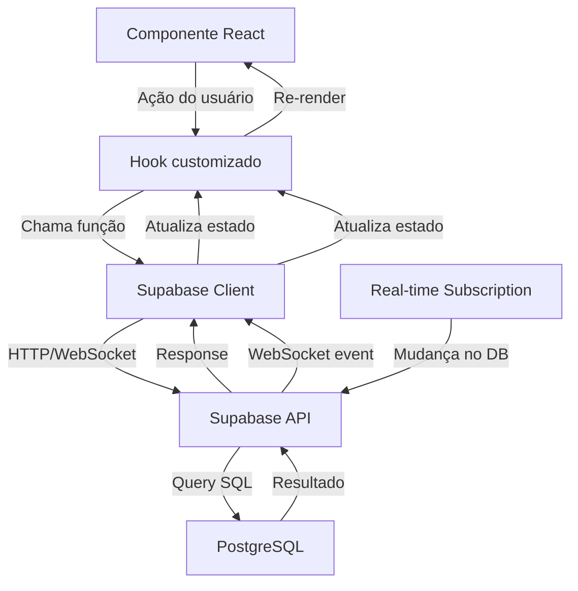
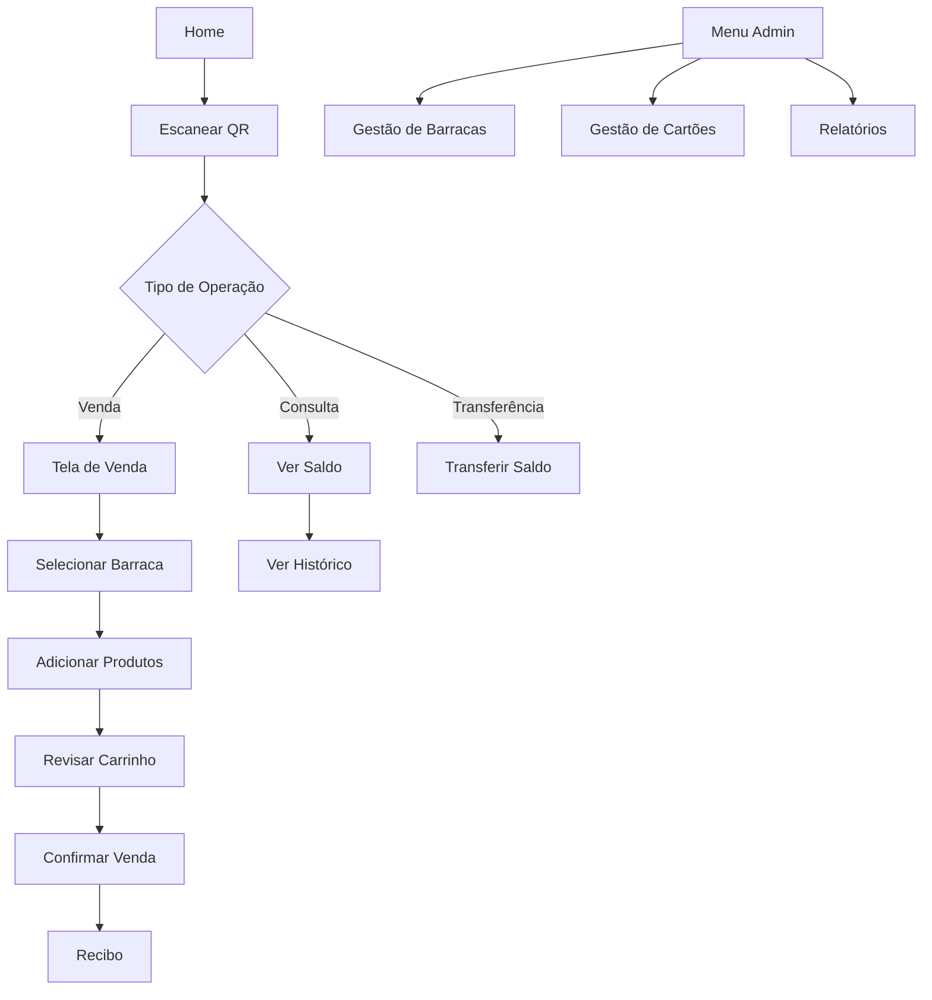

# Especificação Técnica Completa - Sistema de Quermesse

## Índice

1. [Visão Geral](#1-visão-geral)
2. [Arquitetura Completa](#2-arquitetura-completa)
3. [Schema do Banco de Dados](#3-schema-do-banco-de-dados)
4. [Componentes React](#4-componentes-react)
5. [Rotas e Navegação](#5-rotas-e-navegação)
6. [Funcionalidades Críticas](#6-funcionalidades-críticas)
7. [Configurações](#7-configurações)
8. [Segurança](#8-segurança)
9. [Guia de Implementação](#9-guia-de-implementação)

---

## 1. Visão Geral

### 1.1 Contexto do Projeto

Sistema web mobile para gestão de quermesse com cartões pré-pagos, controle de estoque e transações em tempo real.

**Requisitos Críticos:**
- Prazo: 7 dias
- Usuários simultâneos: 20
- Custo: Zero
- Performance: Sem travamentos
- Interface: Profissional
- Acesso: Web mobile apenas

### 1.2 Stack Tecnológica

```
Frontend:
├── React 18.2.0
├── Vite 5.0.0
├── Tailwind CSS 3.4.0
├── shadcn/ui (componentes)
├── React Router DOM 6.21.0
└── Zustand 4.4.7 (state management)

Backend:
├── Supabase (BaaS)
│   ├── PostgreSQL 15
│   ├── REST API auto-gerada
│   ├── Real-time subscriptions
│   └── Row Level Security

Hosting:
├── Vercel (frontend)
└── Supabase Cloud (backend)

Bibliotecas Auxiliares:
├── html5-qrcode 2.3.8 (scanner QR)
├── qrcode 1.5.3 (geração de QR)
└── date-fns 3.0.0 (datas)
```

### 1.3 Perfis de Usuário

1. **Administrador**
   - Gestão completa do sistema
   - Criação de cartões e barracas
   - Visualização de relatórios globais
   - Transferências entre cartões

2. **Operador de Barraca**
   - Vendas na sua barraca
   - Gestão de estoque próprio
   - Histórico de vendas da barraca

3. **Cliente** (via cartão físico)
   - Consulta de saldo
   - Histórico de compras

---

## 2. Arquitetura Completa

### 2.1 Estrutura de Pastas Detalhada

```
quermesse/
├── public/
│   └── favicon.ico
│
├── src/
│   ├── components/
│   │   ├── ui/                          # shadcn/ui components
│   │   │   ├── button.jsx
│   │   │   ├── card.jsx
│   │   │   ├── dialog.jsx
│   │   │   ├── input.jsx
│   │   │   ├── label.jsx
│   │   │   ├── select.jsx
│   │   │   ├── table.jsx
│   │   │   ├── toast.jsx
│   │   │   ├── toaster.jsx
│   │   │   └── use-toast.js
│   │   │
│   │   ├── layout/
│   │   │   ├── Header.jsx
│   │   │   ├── Footer.jsx
│   │   │   └── Layout.jsx
│   │   │
│   │   ├── qr/
│   │   │   ├── QRScanner.jsx
│   │   │   ├── QRGenerator.jsx
│   │   │   └── QRDisplay.jsx
│   │   │
│   │   ├── cards/
│   │   │   ├── CardBalance.jsx
│   │   │   ├── CardList.jsx
│   │   │   ├── CardForm.jsx
│   │   │   └── CardDetails.jsx
│   │   │
│   │   ├── barracas/
│   │   │   ├── BarracaList.jsx
│   │   │   ├── BarracaForm.jsx
│   │   │   ├── BarracaCard.jsx
│   │   │   └── BarracaSelector.jsx
│   │   │
│   │   ├── stock/
│   │   │   ├── ProductList.jsx
│   │   │   ├── ProductForm.jsx
│   │   │   ├── ProductCard.jsx
│   │   │   ├── StockManager.jsx
│   │   │   └── StockAlert.jsx
│   │   │
│   │   ├── transactions/
│   │   │   ├── TransactionHistory.jsx
│   │   │   ├── TransactionItem.jsx
│   │   │   ├── TransactionFilter.jsx
│   │   │   └── TransactionSummary.jsx
│   │   │
│   │   ├── sales/
│   │   │   ├── SaleForm.jsx
│   │   │   ├── SaleCart.jsx
│   │   │   ├── SaleConfirmation.jsx
│   │   │   └── SaleReceipt.jsx
│   │   │
│   │   ├── transfers/
│   │   │   ├── TransferForm.jsx
│   │   │   ├── TransferConfirmation.jsx
│   │   │   └── TransferHistory.jsx
│   │   │
│   │   └── common/
│   │       ├── LoadingSpinner.jsx
│   │       ├── ErrorMessage.jsx
│   │       ├── EmptyState.jsx
│   │       └── ConfirmDialog.jsx
│   │
│   ├── pages/
│   │   ├── Home.jsx
│   │   ├── Dashboard.jsx
│   │   ├── ScanCard.jsx
│   │   ├── CardBalance.jsx
│   │   ├── Sale.jsx
│   │   ├── StockManagement.jsx
│   │   ├── TransferBalance.jsx
│   │   ├── TransactionHistory.jsx
│   │   ├── BarracaManagement.jsx
│   │   ├── CardManagement.jsx
│   │   ├── Reports.jsx
│   │   └── NotFound.jsx
│   │
│   ├── lib/
│   │   ├── supabase.js
│   │   ├── utils.js
│   │   ├── constants.js
│   │   └── validators.js
│   │
│   ├── hooks/
│   │   ├── useCards.js
│   │   ├── useBarracas.js
│   │   ├── useStock.js
│   │   ├── useTransactions.js
│   │   ├── useTransfers.js
│   │   └── useRealtime.js
│   │
│   ├── store/
│   │   ├── useStore.js
│   │   ├── slices/
│   │   │   ├── authSlice.js
│   │   │   ├── cartSlice.js
│   │   │   └── uiSlice.js
│   │   └── index.js
│   │
│   ├── styles/
│   │   ├── globals.css
│   │   └── tailwind.css
│   │
│   ├── App.jsx
│   ├── main.jsx
│   └── router.jsx
│
├── .env.example
├── .env.local
├── .gitignore
├── index.html
├── package.json
├── postcss.config.js
├── tailwind.config.js
├── vite.config.js
└── README.md
```

### 2.2 Fluxo de Dados



### 2.3 Integração com Supabase

#### Cliente Supabase

```javascript
// src/lib/supabase.js
import { createClient } from '@supabase/supabase-js'

const supabaseUrl = import.meta.env.VITE_SUPABASE_URL
const supabaseAnonKey = import.meta.env.VITE_SUPABASE_ANON_KEY

export const supabase = createClient(supabaseUrl, supabaseAnonKey, {
  auth: {
    persistSession: true,
    autoRefreshToken: true,
  },
  realtime: {
    params: {
      eventsPerSecond: 10
    }
  }
})

// Helper para queries com error handling
export async function querySupabase(queryFn) {
  try {
    const { data, error } = await queryFn()
    if (error) throw error
    return { data, error: null }
  } catch (error) {
    console.error('Supabase query error:', error)
    return { data: null, error }
  }
}
```

#### Padrões de Query

```javascript
// Query com relacionamentos
const { data: transactions } = await supabase
  .from('transactions')
  .select(`
    *,
    card:cards(*),
    barraca:barracas(*)
  `)
  .eq('card_id', cardId)
  .order('created_at', { ascending: false })
  .limit(50)

// Insert com retorno
const { data: newCard, error } = await supabase
  .from('cards')
  .insert({ qr_code: qrCode, balance: 0 })
  .select()
  .single()

// Update
const { error } = await supabase
  .from('cards')
  .update({ balance: newBalance })
  .eq('id', cardId)

// RPC (stored procedure)
const { data, error } = await supabase
  .rpc('process_sale', {
    p_card_id: cardId,
    p_barraca_id: barracaId,
    p_amount: amount,
    p_items: items
  })
```

---

Continua no próximo arquivo...

## 3. Schema do Banco de Dados

### 3.1 Tabelas Principais

#### 3.1.1 Tabela: cards

```sql
-- Cartões pré-pagos
CREATE TABLE cards (
  id UUID PRIMARY KEY DEFAULT uuid_generate_v4(),
  qr_code TEXT UNIQUE NOT NULL,
  balance DECIMAL(10,2) NOT NULL DEFAULT 0 CHECK (balance >= 0),
  status TEXT NOT NULL DEFAULT 'active' CHECK (status IN ('active', 'blocked', 'cancelled')),
  holder_name TEXT,
  holder_phone TEXT,
  created_at TIMESTAMP WITH TIME ZONE DEFAULT NOW(),
  updated_at TIMESTAMP WITH TIME ZONE DEFAULT NOW(),
  created_by UUID,
  notes TEXT
);

-- Índices
CREATE INDEX idx_cards_qr_code ON cards(qr_code);
CREATE INDEX idx_cards_status ON cards(status);
CREATE INDEX idx_cards_created_at ON cards(created_at);

-- Trigger para atualizar updated_at
CREATE OR REPLACE FUNCTION update_updated_at_column()
RETURNS TRIGGER AS $$
BEGIN
  NEW.updated_at = NOW();
  RETURN NEW;
END;
$$ LANGUAGE plpgsql;

CREATE TRIGGER update_cards_updated_at
  BEFORE UPDATE ON cards
  FOR EACH ROW
  EXECUTE FUNCTION update_updated_at_column();

-- Comentários
COMMENT ON TABLE cards IS 'Cartões pré-pagos dos clientes';
COMMENT ON COLUMN cards.qr_code IS 'Código QR único do cartão';
COMMENT ON COLUMN cards.balance IS 'Saldo atual do cartão em reais';
COMMENT ON COLUMN cards.status IS 'Status: active, blocked, cancelled';
```

#### 3.1.2 Tabela: barracas

```sql
-- Barracas da quermesse
CREATE TABLE barracas (
  id UUID PRIMARY KEY DEFAULT uuid_generate_v4(),
  name TEXT NOT NULL,
  description TEXT,
  owner_name TEXT NOT NULL,
  owner_phone TEXT,
  owner_email TEXT,
  status TEXT NOT NULL DEFAULT 'active' CHECK (status IN ('active', 'inactive')),
  location TEXT,
  category TEXT,
  created_at TIMESTAMP WITH TIME ZONE DEFAULT NOW(),
  updated_at TIMESTAMP WITH TIME ZONE DEFAULT NOW(),
  created_by UUID,
  notes TEXT
);

-- Índices
CREATE INDEX idx_barracas_status ON barracas(status);
CREATE INDEX idx_barracas_category ON barracas(category);
CREATE INDEX idx_barracas_name ON barracas(name);

-- Trigger
CREATE TRIGGER update_barracas_updated_at
  BEFORE UPDATE ON barracas
  FOR EACH ROW
  EXECUTE FUNCTION update_updated_at_column();

COMMENT ON TABLE barracas IS 'Barracas participantes da quermesse';
```

#### 3.1.3 Tabela: stock

```sql
-- Estoque de produtos por barraca
CREATE TABLE stock (
  id UUID PRIMARY KEY DEFAULT uuid_generate_v4(),
  barraca_id UUID NOT NULL REFERENCES barracas(id) ON DELETE CASCADE,
  item_name TEXT NOT NULL,
  description TEXT,
  quantity INTEGER NOT NULL DEFAULT 0 CHECK (quantity >= 0),
  price DECIMAL(10,2) NOT NULL CHECK (price >= 0),
  cost DECIMAL(10,2) CHECK (cost >= 0),
  category TEXT,
  image_url TEXT,
  status TEXT NOT NULL DEFAULT 'available' CHECK (status IN ('available', 'unavailable', 'out_of_stock')),
  min_stock INTEGER DEFAULT 0,
  created_at TIMESTAMP WITH TIME ZONE DEFAULT NOW(),
  updated_at TIMESTAMP WITH TIME ZONE DEFAULT NOW(),
  UNIQUE(barraca_id, item_name)
);

-- Índices
CREATE INDEX idx_stock_barraca_id ON stock(barraca_id);
CREATE INDEX idx_stock_status ON stock(status);
CREATE INDEX idx_stock_category ON stock(category);
CREATE INDEX idx_stock_quantity ON stock(quantity);

-- Trigger
CREATE TRIGGER update_stock_updated_at
  BEFORE UPDATE ON stock
  FOR EACH ROW
  EXECUTE FUNCTION update_updated_at_column();

-- Trigger para atualizar status baseado em quantidade
CREATE OR REPLACE FUNCTION update_stock_status()
RETURNS TRIGGER AS $$
BEGIN
  IF NEW.quantity = 0 THEN
    NEW.status = 'out_of_stock';
  ELSIF NEW.status = 'out_of_stock' AND NEW.quantity > 0 THEN
    NEW.status = 'available';
  END IF;
  RETURN NEW;
END;
$$ LANGUAGE plpgsql;

CREATE TRIGGER update_stock_status_trigger
  BEFORE INSERT OR UPDATE OF quantity ON stock
  FOR EACH ROW
  EXECUTE FUNCTION update_stock_status();

COMMENT ON TABLE stock IS 'Estoque de produtos por barraca';
```

#### 3.1.4 Tabela: transactions

```sql
-- Transações (vendas, recargas, estornos)
CREATE TABLE transactions (
  id UUID PRIMARY KEY DEFAULT uuid_generate_v4(),
  card_id UUID NOT NULL REFERENCES cards(id) ON DELETE RESTRICT,
  barraca_id UUID REFERENCES barracas(id) ON DELETE RESTRICT,
  amount DECIMAL(10,2) NOT NULL,
  type TEXT NOT NULL CHECK (type IN ('purchase', 'refund', 'recharge', 'adjustment')),
  status TEXT NOT NULL DEFAULT 'completed' CHECK (status IN ('pending', 'completed', 'cancelled', 'failed')),
  description TEXT,
  items JSONB,
  previous_balance DECIMAL(10,2),
  new_balance DECIMAL(10,2),
  idempotency_key TEXT UNIQUE,
  created_at TIMESTAMP WITH TIME ZONE DEFAULT NOW(),
  created_by UUID,
  cancelled_at TIMESTAMP WITH TIME ZONE,
  cancelled_by UUID,
  cancellation_reason TEXT,
  metadata JSONB
);

-- Índices
CREATE INDEX idx_transactions_card_id ON transactions(card_id);
CREATE INDEX idx_transactions_barraca_id ON transactions(barraca_id);
CREATE INDEX idx_transactions_type ON transactions(type);
CREATE INDEX idx_transactions_status ON transactions(status);
CREATE INDEX idx_transactions_created_at ON transactions(created_at DESC);
CREATE INDEX idx_transactions_idempotency_key ON transactions(idempotency_key);
CREATE INDEX idx_transactions_items ON transactions USING GIN (items);
CREATE INDEX idx_transactions_metadata ON transactions USING GIN (metadata);

COMMENT ON TABLE transactions IS 'Histórico de todas as transações';
COMMENT ON COLUMN transactions.idempotency_key IS 'Previne transações duplicadas';
```

#### 3.1.5 Tabela: transfers

```sql
-- Transferências entre cartões
CREATE TABLE transfers (
  id UUID PRIMARY KEY DEFAULT uuid_generate_v4(),
  from_card_id UUID NOT NULL REFERENCES cards(id) ON DELETE RESTRICT,
  to_card_id UUID NOT NULL REFERENCES cards(id) ON DELETE RESTRICT,
  amount DECIMAL(10,2) NOT NULL CHECK (amount > 0),
  status TEXT NOT NULL DEFAULT 'completed' CHECK (status IN ('pending', 'completed', 'cancelled', 'failed')),
  description TEXT,
  from_previous_balance DECIMAL(10,2),
  from_new_balance DECIMAL(10,2),
  to_previous_balance DECIMAL(10,2),
  to_new_balance DECIMAL(10,2),
  idempotency_key TEXT UNIQUE,
  created_at TIMESTAMP WITH TIME ZONE DEFAULT NOW(),
  created_by UUID,
  cancelled_at TIMESTAMP WITH TIME ZONE,
  cancelled_by UUID,
  cancellation_reason TEXT,
  metadata JSONB,
  CHECK (from_card_id != to_card_id)
);

-- Índices
CREATE INDEX idx_transfers_from_card_id ON transfers(from_card_id);
CREATE INDEX idx_transfers_to_card_id ON transfers(to_card_id);
CREATE INDEX idx_transfers_status ON transfers(status);
CREATE INDEX idx_transfers_created_at ON transfers(created_at DESC);
CREATE INDEX idx_transfers_idempotency_key ON transfers(idempotency_key);

COMMENT ON TABLE transfers IS 'Transferências de saldo entre cartões';
```

#### 3.1.6 Tabela: stock_movements

```sql
-- Movimentações de estoque
CREATE TABLE stock_movements (
  id UUID PRIMARY KEY DEFAULT uuid_generate_v4(),
  stock_id UUID NOT NULL REFERENCES stock(id) ON DELETE CASCADE,
  transaction_id UUID REFERENCES transactions(id) ON DELETE SET NULL,
  quantity INTEGER NOT NULL,
  type TEXT NOT NULL CHECK (type IN ('sale', 'restock', 'adjustment', 'loss')),
  previous_quantity INTEGER NOT NULL,
  new_quantity INTEGER NOT NULL,
  notes TEXT,
  created_at TIMESTAMP WITH TIME ZONE DEFAULT NOW(),
  created_by UUID
);

-- Índices
CREATE INDEX idx_stock_movements_stock_id ON stock_movements(stock_id);
CREATE INDEX idx_stock_movements_transaction_id ON stock_movements(transaction_id);
CREATE INDEX idx_stock_movements_type ON stock_movements(type);
CREATE INDEX idx_stock_movements_created_at ON stock_movements(created_at DESC);

COMMENT ON TABLE stock_movements IS 'Histórico de movimentações de estoque';
```

#### 3.1.7 Tabela: audit_log

```sql
-- Log de auditoria
CREATE TABLE audit_log (
  id UUID PRIMARY KEY DEFAULT uuid_generate_v4(),
  table_name TEXT NOT NULL,
  record_id UUID NOT NULL,
  action TEXT NOT NULL CHECK (action IN ('INSERT', 'UPDATE', 'DELETE')),
  old_data JSONB,
  new_data JSONB,
  changed_fields TEXT[],
  user_id UUID,
  ip_address INET,
  user_agent TEXT,
  created_at TIMESTAMP WITH TIME ZONE DEFAULT NOW()
);

-- Índices
CREATE INDEX idx_audit_log_table_name ON audit_log(table_name);
CREATE INDEX idx_audit_log_record_id ON audit_log(record_id);
CREATE INDEX idx_audit_log_action ON audit_log(action);
CREATE INDEX idx_audit_log_created_at ON audit_log(created_at DESC);
CREATE INDEX idx_audit_log_user_id ON audit_log(user_id);

COMMENT ON TABLE audit_log IS 'Log de auditoria de operações críticas';
```

### 3.2 Views Úteis

```sql
-- View: Resumo de vendas por barraca
CREATE OR REPLACE VIEW barraca_sales_summary AS
SELECT 
  b.id,
  b.name,
  COUNT(t.id) as total_transactions,
  COALESCE(SUM(t.amount), 0) as total_sales,
  COALESCE(AVG(t.amount), 0) as average_sale,
  MAX(t.created_at) as last_sale
FROM barracas b
LEFT JOIN transactions t ON t.barraca_id = b.id 
  AND t.type = 'purchase' 
  AND t.status = 'completed'
GROUP BY b.id, b.name;

-- View: Estoque baixo
CREATE OR REPLACE VIEW low_stock_items AS
SELECT 
  s.*,
  b.name as barraca_name
FROM stock s
JOIN barracas b ON b.id = s.barraca_id
WHERE s.quantity <= s.min_stock
  AND s.status = 'available'
ORDER BY s.quantity ASC;

-- View: Cartões com saldo
CREATE OR REPLACE VIEW cards_with_balance AS
SELECT 
  c.*,
  COUNT(t.id) as transaction_count,
  MAX(t.created_at) as last_transaction
FROM cards c
LEFT JOIN transactions t ON t.card_id = c.id
WHERE c.status = 'active' AND c.balance > 0
GROUP BY c.id;
```

### 3.3 Stored Procedures (RPC)

#### 3.3.1 Processar Venda

```sql
CREATE OR REPLACE FUNCTION process_sale(
  p_card_id UUID,
  p_barraca_id UUID,
  p_amount DECIMAL(10,2),
  p_items JSONB,
  p_idempotency_key TEXT DEFAULT NULL
)
RETURNS JSONB
LANGUAGE plpgsql
SECURITY DEFINER
AS $$
DECLARE
  v_card_balance DECIMAL(10,2);
  v_transaction_id UUID;
  v_item JSONB;
  v_stock_id UUID;
  v_quantity INTEGER;
BEGIN
  -- Verificar idempotência
  IF p_idempotency_key IS NOT NULL THEN
    SELECT id INTO v_transaction_id
    FROM transactions
    WHERE idempotency_key = p_idempotency_key;
    
    IF FOUND THEN
      RETURN jsonb_build_object(
        'success', true,
        'transaction_id', v_transaction_id,
        'message', 'Transaction already processed'
      );
    END IF;
  END IF;

  -- Bloquear cartão
  SELECT balance INTO v_card_balance
  FROM cards
  WHERE id = p_card_id AND status = 'active'
  FOR UPDATE;

  IF NOT FOUND THEN
    RETURN jsonb_build_object(
      'success', false,
      'error', 'Card not found or inactive'
    );
  END IF;

  -- Verificar saldo
  IF v_card_balance < p_amount THEN
    RETURN jsonb_build_object(
      'success', false,
      'error', 'Insufficient balance',
      'current_balance', v_card_balance,
      'required_amount', p_amount
    );
  END IF;

  -- Processar itens e atualizar estoque
  FOR v_item IN SELECT * FROM jsonb_array_elements(p_items)
  LOOP
    v_stock_id := (v_item->>'stock_id')::UUID;
    v_quantity := (v_item->>'quantity')::INTEGER;

    -- Atualizar estoque
    UPDATE stock
    SET quantity = quantity - v_quantity,
        updated_at = NOW()
    WHERE id = v_stock_id
      AND quantity >= v_quantity
      AND status = 'available';

    IF NOT FOUND THEN
      RAISE EXCEPTION 'Insufficient stock for item %', v_stock_id;
    END IF;

    -- Registrar movimentação
    INSERT INTO stock_movements (
      stock_id,
      quantity,
      type,
      previous_quantity,
      new_quantity
    )
    SELECT 
      v_stock_id,
      -v_quantity,
      'sale',
      quantity + v_quantity,
      quantity
    FROM stock
    WHERE id = v_stock_id;
  END LOOP;

  -- Atualizar saldo
  UPDATE cards
  SET balance = balance - p_amount,
      updated_at = NOW()
  WHERE id = p_card_id;

  -- Criar transação
  INSERT INTO transactions (
    card_id,
    barraca_id,
    amount,
    type,
    status,
    items,
    previous_balance,
    new_balance,
    idempotency_key
  )
  VALUES (
    p_card_id,
    p_barraca_id,
    p_amount,
    'purchase',
    'completed',
    p_items,
    v_card_balance,
    v_card_balance - p_amount,
    p_idempotency_key
  )
  RETURNING id INTO v_transaction_id;

  -- Atualizar referência nas movimentações
  UPDATE stock_movements
  SET transaction_id = v_transaction_id
  WHERE transaction_id IS NULL
    AND created_at >= NOW() - INTERVAL '1 second';

  RETURN jsonb_build_object(
    'success', true,
    'transaction_id', v_transaction_id,
    'new_balance', v_card_balance - p_amount
  );

EXCEPTION
  WHEN OTHERS THEN
    RETURN jsonb_build_object(
      'success', false,
      'error', SQLERRM
    );
END;
$$;

COMMENT ON FUNCTION process_sale IS 'Processa venda com atualização atômica';
```

#### 3.3.2 Processar Transferência

```sql
CREATE OR REPLACE FUNCTION process_transfer(
  p_from_card_id UUID,
  p_to_card_id UUID,
  p_amount DECIMAL(10,2),
  p_idempotency_key TEXT DEFAULT NULL
)
RETURNS JSONB
LANGUAGE plpgsql
SECURITY DEFINER
AS $$
DECLARE
  v_from_balance DECIMAL(10,2);
  v_to_balance DECIMAL(10,2);
  v_transfer_id UUID;
BEGIN
  -- Verificar idempotência
  IF p_idempotency_key IS NOT NULL THEN
    SELECT id INTO v_transfer_id
    FROM transfers
    WHERE idempotency_key = p_idempotency_key;
    
    IF FOUND THEN
      RETURN jsonb_build_object(
        'success', true,
        'transfer_id', v_transfer_id,
        'message', 'Transfer already processed'
      );
    END IF;
  END IF;

  -- Validar cartões diferentes
  IF p_from_card_id = p_to_card_id THEN
    RETURN jsonb_build_object(
      'success', false,
      'error', 'Cannot transfer to the same card'
    );
  END IF;

  -- Bloquear cartões (ordem consistente para evitar deadlock)
  IF p_from_card_id < p_to_card_id THEN
    SELECT balance INTO v_from_balance
    FROM cards WHERE id = p_from_card_id AND status = 'active' FOR UPDATE;
    SELECT balance INTO v_to_balance
    FROM cards WHERE id = p_to_card_id AND status = 'active' FOR UPDATE;
  ELSE
    SELECT balance INTO v_to_balance
    FROM cards WHERE id = p_to_card_id AND status = 'active' FOR UPDATE;
    SELECT balance INTO v_from_balance
    FROM cards WHERE id = p_from_card_id AND status = 'active' FOR UPDATE;
  END IF;

  -- Verificar existência
  IF v_from_balance IS NULL THEN
    RETURN jsonb_build_object('success', false, 'error', 'Source card not found');
  END IF;
  IF v_to_balance IS NULL THEN
    RETURN jsonb_build_object('success', false, 'error', 'Destination card not found');
  END IF;

  -- Verificar saldo
  IF v_from_balance < p_amount THEN
    RETURN jsonb_build_object(
      'success', false,
      'error', 'Insufficient balance',
      'current_balance', v_from_balance
    );
  END IF;

  -- Atualizar saldos
  UPDATE cards SET balance = balance - p_amount, updated_at = NOW()
  WHERE id = p_from_card_id;
  
  UPDATE cards SET balance = balance + p_amount, updated_at = NOW()
  WHERE id = p_to_card_id;

  -- Criar transferência
  INSERT INTO transfers (
    from_card_id, to_card_id, amount, status,
    from_previous_balance, from_new_balance,
    to_previous_balance, to_new_balance,
    idempotency_key
  )
  VALUES (
    p_from_card_id, p_to_card_id, p_amount, 'completed',
    v_from_balance, v_from_balance - p_amount,
    v_to_balance, v_to_balance + p_amount,
    p_idempotency_key
  )
  RETURNING id INTO v_transfer_id;

  RETURN jsonb_build_object(
    'success', true,
    'transfer_id', v_transfer_id,
    'from_new_balance', v_from_balance - p_amount,
    'to_new_balance', v_to_balance + p_amount
  );

EXCEPTION
  WHEN OTHERS THEN
    RETURN jsonb_build_object('success', false, 'error', SQLERRM);
END;
$$;
```

#### 3.3.3 Recarregar Cartão

```sql
CREATE OR REPLACE FUNCTION recharge_card(
  p_card_id UUID,
  p_amount DECIMAL(10,2),
  p_description TEXT DEFAULT NULL,
  p_idempotency_key TEXT DEFAULT NULL
)
RETURNS JSONB
LANGUAGE plpgsql
SECURITY DEFINER
AS $$
DECLARE
  v_card_balance DECIMAL(10,2);
  v_transaction_id UUID;
BEGIN
  -- Verificar idempotência
  IF p_idempotency_key IS NOT NULL THEN
    SELECT id INTO v_transaction_id
    FROM transactions WHERE idempotency_key = p_idempotency_key;
    IF FOUND THEN
      RETURN jsonb_build_object('success', true, 'transaction_id', v_transaction_id);
    END IF;
  END IF;

  -- Validar valor
  IF p_amount <= 0 THEN
    RETURN jsonb_build_object('success', false, 'error', 'Amount must be positive');
  END IF;

  -- Bloquear cartão
  SELECT balance INTO v_card_balance
  FROM cards WHERE id = p_card_id AND status = 'active' FOR UPDATE;

  IF NOT FOUND THEN
    RETURN jsonb_build_object('success', false, 'error', 'Card not found');
  END IF;

  -- Atualizar saldo
  UPDATE cards SET balance = balance + p_amount, updated_at = NOW()
  WHERE id = p_card_id;

  -- Criar transação
  INSERT INTO transactions (
    card_id, amount, type, status, description,
    previous_balance, new_balance, idempotency_key
  )
  VALUES (
    p_card_id, p_amount, 'recharge', 'completed',
    COALESCE(p_description, 'Card recharge'),
    v_card_balance, v_card_balance + p_amount, p_idempotency_key
  )
  RETURNING id INTO v_transaction_id;

  RETURN jsonb_build_object(
    'success', true,
    'transaction_id', v_transaction_id,
    'new_balance', v_card_balance + p_amount
  );

EXCEPTION
  WHEN OTHERS THEN
    RETURN jsonb_build_object('success', false, 'error', SQLERRM);
END;
$$;
```

### 3.4 Row Level Security (RLS)

```sql
-- Habilitar RLS
ALTER TABLE cards ENABLE ROW LEVEL SECURITY;
ALTER TABLE barracas ENABLE ROW LEVEL SECURITY;
ALTER TABLE stock ENABLE ROW LEVEL SECURITY;
ALTER TABLE transactions ENABLE ROW LEVEL SECURITY;
ALTER TABLE transfers ENABLE ROW LEVEL SECURITY;
ALTER TABLE stock_movements ENABLE ROW LEVEL SECURITY;
ALTER TABLE audit_log ENABLE ROW LEVEL SECURITY;

-- Políticas para cards
CREATE POLICY "Anyone can read active cards"
  ON cards FOR SELECT
  USING (status = 'active');

CREATE POLICY "Only admins can modify cards"
  ON cards FOR ALL
  USING (auth.jwt() ->> 'role' = 'admin');

-- Políticas para barracas
CREATE POLICY "Anyone can read active barracas"
  ON barracas FOR SELECT
  USING (status = 'active');

CREATE POLICY "Only admins can modify barracas"
  ON barracas FOR ALL
  USING (auth.jwt() ->> 'role' = 'admin');

-- Políticas para stock
CREATE POLICY "Anyone can read available stock"
  ON stock FOR SELECT
  USING (status IN ('available', 'out_of_stock'));

CREATE POLICY "Operators can update own barraca stock"
  ON stock FOR UPDATE
  USING (
    barraca_id IN (
      SELECT id FROM barracas
      WHERE owner_email = auth.jwt() ->> 'email'
    )
  );

CREATE POLICY "Admins can do everything with stock"
  ON stock FOR ALL
  USING (auth.jwt() ->> 'role' = 'admin');

-- Políticas para transactions
CREATE POLICY "Users can read own card transactions"
  ON transactions FOR SELECT
  USING (
    card_id IN (
      SELECT id FROM cards
      WHERE qr_code = current_setting('app.current_qr_code', true)
    )
  );

CREATE POLICY "Operators can read own barraca transactions"
  ON transactions FOR SELECT
  USING (
    barraca_id IN (
      SELECT id FROM barracas
      WHERE owner_email = auth.jwt() ->> 'email'
    )
  );

CREATE POLICY "Admins can read all transactions"
  ON transactions FOR SELECT
  USING (auth.jwt() ->> 'role' = 'admin');
```

### 3.5 Triggers de Auditoria

```sql
-- Função genérica de auditoria
CREATE OR REPLACE FUNCTION audit_trigger_func()
RETURNS TRIGGER AS $$
DECLARE
  v_old_data JSONB;
  v_new_data JSONB;
  v_changed_fields TEXT[];
BEGIN
  IF TG_OP = 'DELETE' THEN
    v_old_data = to_jsonb(OLD);
    v_new_data = NULL;
  ELSIF TG_OP = 'UPDATE' THEN
    v_old_data = to_jsonb(OLD);
    v_new_data = to_jsonb(NEW);
    
    SELECT array_agg(key)
    INTO v_changed_fields
    FROM jsonb_each(v_new_data)
    WHERE v_new_data->key IS DISTINCT FROM v_old_data->key;
  ELSIF TG_OP = 'INSERT' THEN
    v_old_data = NULL;
    v_new_data = to_jsonb(NEW);
  END IF;

  INSERT INTO audit_log (
    table_name, record_id, action,
    old_data, new_data, changed_fields, user_id
  )
  VALUES (
    TG_TABLE_NAME,
    COALESCE(NEW.id, OLD.id),
    TG_OP,
    v_old_data,
    v_new_data,
    v_changed_fields,
    (auth.jwt() ->> 'sub')::UUID
  );

  RETURN COALESCE(NEW, OLD);
END;
$$ LANGUAGE plpgsql SECURITY DEFINER;

-- Aplicar triggers
CREATE TRIGGER audit_cards
  AFTER INSERT OR UPDATE OR DELETE ON cards
  FOR EACH ROW EXECUTE FUNCTION audit_trigger_func();

CREATE TRIGGER audit_transactions
  AFTER INSERT OR UPDATE OR DELETE ON transactions
  FOR EACH ROW EXECUTE FUNCTION audit_trigger_func();

CREATE TRIGGER audit_transfers
  AFTER INSERT OR UPDATE OR DELETE ON transfers
  FOR EACH ROW EXECUTE FUNCTION audit_trigger_func();
```


## 4. Componentes React

### 4.1 Componentes UI (shadcn/ui)

Componentes base do shadcn/ui a serem instalados:

```bash
npx shadcn-ui@latest add button
npx shadcn-ui@latest add card
npx shadcn-ui@latest add dialog
npx shadcn-ui@latest add input
npx shadcn-ui@latest add label
npx shadcn-ui@latest add select
npx shadcn-ui@latest add table
npx shadcn-ui@latest add toast
npx shadcn-ui@latest add badge
npx shadcn-ui@latest add alert
npx shadcn-ui@latest add tabs
npx shadcn-ui@latest add separator
```

### 4.2 Componentes de Layout

#### Header.jsx

```jsx
// src/components/layout/Header.jsx
import { Link, useLocation } from 'react-router-dom'
import { Button } from '@/components/ui/button'

export function Header() {
  const location = useLocation()
  
  return (
    <header className="sticky top-0 z-50 w-full border-b bg-background/95 backdrop-blur">
      <div className="container flex h-16 items-center justify-between">
        <Link to="/" className="flex items-center space-x-2">
          <span className="text-xl font-bold">Quermesse</span>
        </Link>
        
        <nav className="flex items-center space-x-4">
          <Link to="/scan">
            <Button variant={location.pathname === '/scan' ? 'default' : 'ghost'}>
              Escanear
            </Button>
          </Link>
          <Link to="/sale">
            <Button variant={location.pathname === '/sale' ? 'default' : 'ghost'}>
              Vender
            </Button>
          </Link>
          <Link to="/stock">
            <Button variant={location.pathname === '/stock' ? 'default' : 'ghost'}>
              Estoque
            </Button>
          </Link>
        </nav>
      </div>
    </header>
  )
}
```

**Props:** Nenhuma  
**Estado:** `location` (do React Router)  
**Responsabilidades:**
- Navegação principal
- Indicação visual da rota ativa
- Responsivo para mobile

#### Layout.jsx

```jsx
// src/components/layout/Layout.jsx
import { Header } from './Header'
import { Footer } from './Footer'
import { Toaster } from '@/components/ui/toaster'

export function Layout({ children }) {
  return (
    <div className="min-h-screen flex flex-col">
      <Header />
      <main className="flex-1 container py-6">
        {children}
      </main>
      <Footer />
      <Toaster />
    </div>
  )
}
```

**Props:**
- `children`: ReactNode - Conteúdo da página

### 4.3 Componentes de QR Code

#### QRScanner.jsx

```jsx
// src/components/qr/QRScanner.jsx
import { useEffect, useRef, useState } from 'react'
import { Html5Qrcode } from 'html5-qrcode'
import { Button } from '@/components/ui/button'
import { Card } from '@/components/ui/card'

export function QRScanner({ onScan, onError }) {
  const [isScanning, setIsScanning] = useState(false)
  const scannerRef = useRef(null)
  const html5QrCodeRef = useRef(null)

  const startScanning = async () => {
    try {
      const html5QrCode = new Html5Qrcode("qr-reader")
      html5QrCodeRef.current = html5QrCode
      
      await html5QrCode.start(
        { facingMode: "environment" },
        {
          fps: 10,
          qrbox: { width: 250, height: 250 }
        },
        (decodedText) => {
          onScan(decodedText)
          stopScanning()
        },
        (errorMessage) => {
          // Ignora erros de scan contínuo
        }
      )
      
      setIsScanning(true)
    } catch (err) {
      onError?.(err.message)
    }
  }

  const stopScanning = async () => {
    if (html5QrCodeRef.current) {
      await html5QrCodeRef.current.stop()
      html5QrCodeRef.current = null
      setIsScanning(false)
    }
  }

  useEffect(() => {
    return () => {
      stopScanning()
    }
  }, [])

  return (
    <Card className="p-6">
      <div id="qr-reader" className="w-full" />
      
      <div className="mt-4 flex justify-center">
        {!isScanning ? (
          <Button onClick={startScanning} size="lg">
            Iniciar Scanner
          </Button>
        ) : (
          <Button onClick={stopScanning} variant="destructive" size="lg">
            Parar Scanner
          </Button>
        )}
      </div>
    </Card>
  )
}
```

**Props:**
- `onScan`: (qrCode: string) => void - Callback quando QR é escaneado
- `onError`: (error: string) => void - Callback de erro

**Estado:**
- `isScanning`: boolean - Se está escaneando
- `html5QrCodeRef`: Ref para instância do scanner

#### QRGenerator.jsx

```jsx
// src/components/qr/QRGenerator.jsx
import { useEffect, useRef } from 'react'
import QRCode from 'qrcode'
import { Card } from '@/components/ui/card'
import { Button } from '@/components/ui/button'

export function QRGenerator({ value, size = 256 }) {
  const canvasRef = useRef(null)

  useEffect(() => {
    if (canvasRef.current && value) {
      QRCode.toCanvas(canvasRef.current, value, {
        width: size,
        margin: 2,
        color: {
          dark: '#000000',
          light: '#FFFFFF'
        }
      })
    }
  }, [value, size])

  const downloadQR = () => {
    const canvas = canvasRef.current
    const url = canvas.toDataURL('image/png')
    const link = document.createElement('a')
    link.download = `qr-${value}.png`
    link.href = url
    link.click()
  }

  return (
    <Card className="p-6 flex flex-col items-center space-y-4">
      <canvas ref={canvasRef} />
      <Button onClick={downloadQR} variant="outline">
        Baixar QR Code
      </Button>
    </Card>
  )
}
```

**Props:**
- `value`: string - Valor a ser codificado
- `size`: number - Tamanho do QR (default: 256)

### 4.4 Componentes de Cartões

#### CardBalance.jsx

```jsx
// src/components/cards/CardBalance.jsx
import { Card, CardContent, CardHeader, CardTitle } from '@/components/ui/card'
import { Badge } from '@/components/ui/badge'

export function CardBalance({ card, showDetails = false }) {
  const formatCurrency = (value) => {
    return new Intl.NumberFormat('pt-BR', {
      style: 'currency',
      currency: 'BRL'
    }).format(value)
  }

  return (
    <Card>
      <CardHeader>
        <CardTitle className="flex items-center justify-between">
          <span>Cartão</span>
          <Badge variant={card.status === 'active' ? 'default' : 'destructive'}>
            {card.status}
          </Badge>
        </CardTitle>
      </CardHeader>
      <CardContent>
        <div className="space-y-2">
          <div className="text-3xl font-bold">
            {formatCurrency(card.balance)}
          </div>
          
          {showDetails && (
            <>
              <div className="text-sm text-muted-foreground">
                QR Code: {card.qr_code}
              </div>
              {card.holder_name && (
                <div className="text-sm">
                  Titular: {card.holder_name}
                </div>
              )}
            </>
          )}
        </div>
      </CardContent>
    </Card>
  )
}
```

**Props:**
- `card`: Object - Dados do cartão
  - `id`: UUID
  - `qr_code`: string
  - `balance`: number
  - `status`: string
  - `holder_name`: string (opcional)
- `showDetails`: boolean - Mostrar detalhes extras

### 4.5 Componentes de Vendas

#### SaleCart.jsx

```jsx
// src/components/sales/SaleCart.jsx
import { Card, CardContent, CardHeader, CardTitle } from '@/components/ui/card'
import { Button } from '@/components/ui/button'
import { Separator } from '@/components/ui/separator'
import { Trash2, Plus, Minus } from 'lucide-react'

export function SaleCart({ items, onUpdateQuantity, onRemoveItem, onCheckout }) {
  const total = items.reduce((sum, item) => 
    sum + (item.price * item.quantity), 0
  )

  const formatCurrency = (value) => {
    return new Intl.NumberFormat('pt-BR', {
      style: 'currency',
      currency: 'BRL'
    }).format(value)
  }

  return (
    <Card>
      <CardHeader>
        <CardTitle>Carrinho ({items.length} itens)</CardTitle>
      </CardHeader>
      <CardContent>
        <div className="space-y-4">
          {items.map((item) => (
            <div key={item.stock_id} className="flex items-center justify-between">
              <div className="flex-1">
                <div className="font-medium">{item.item_name}</div>
                <div className="text-sm text-muted-foreground">
                  {formatCurrency(item.price)} x {item.quantity}
                </div>
              </div>
              
              <div className="flex items-center space-x-2">
                <Button
                  size="icon"
                  variant="outline"
                  onClick={() => onUpdateQuantity(item.stock_id, item.quantity - 1)}
                  disabled={item.quantity <= 1}
                >
                  <Minus className="h-4 w-4" />
                </Button>
                
                <span className="w-8 text-center">{item.quantity}</span>
                
                <Button
                  size="icon"
                  variant="outline"
                  onClick={() => onUpdateQuantity(item.stock_id, item.quantity + 1)}
                >
                  <Plus className="h-4 w-4" />
                </Button>
                
                <Button
                  size="icon"
                  variant="destructive"
                  onClick={() => onRemoveItem(item.stock_id)}
                >
                  <Trash2 className="h-4 w-4" />
                </Button>
              </div>
            </div>
          ))}
          
          {items.length === 0 && (
            <div className="text-center text-muted-foreground py-8">
              Carrinho vazio
            </div>
          )}
          
          {items.length > 0 && (
            <>
              <Separator />
              <div className="flex items-center justify-between text-lg font-bold">
                <span>Total</span>
                <span>{formatCurrency(total)}</span>
              </div>
              
              <Button 
                className="w-full" 
                size="lg"
                onClick={() => onCheckout(total)}
              >
                Finalizar Venda
              </Button>
            </>
          )}
        </div>
      </CardContent>
    </Card>
  )
}
```

**Props:**
- `items`: Array - Itens no carrinho
- `onUpdateQuantity`: (stockId, newQuantity) => void
- `onRemoveItem`: (stockId) => void
- `onCheckout`: (total) => void

**Estado:** Gerenciado pelo componente pai

### 4.6 Componentes de Estoque

#### ProductCard.jsx

```jsx
// src/components/stock/ProductCard.jsx
import { Card, CardContent } from '@/components/ui/card'
import { Button } from '@/components/ui/button'
import { Badge } from '@/components/ui/badge'
import { Plus, Edit, AlertTriangle } from 'lucide-react'

export function ProductCard({ product, onAdd, onEdit, mode = 'sale' }) {
  const formatCurrency = (value) => {
    return new Intl.NumberFormat('pt-BR', {
      style: 'currency',
      currency: 'BRL'
    }).format(value)
  }

  const isLowStock = product.quantity <= product.min_stock
  const isOutOfStock = product.quantity === 0

  return (
    <Card className={isOutOfStock ? 'opacity-50' : ''}>
      <CardContent className="p-4">
        <div className="flex items-start justify-between">
          <div className="flex-1">
            <h3 className="font-semibold">{product.item_name}</h3>
            {product.description && (
              <p className="text-sm text-muted-foreground mt-1">
                {product.description}
              </p>
            )}
            
            <div className="mt-2 flex items-center space-x-2">
              <span className="text-lg font-bold">
                {formatCurrency(product.price)}
              </span>
              
              {isLowStock && !isOutOfStock && (
                <Badge variant="warning" className="flex items-center gap-1">
                  <AlertTriangle className="h-3 w-3" />
                  Estoque baixo
                </Badge>
              )}
              
              {isOutOfStock && (
                <Badge variant="destructive">Esgotado</Badge>
              )}
            </div>
            
            <div className="text-sm text-muted-foreground mt-1">
              Estoque: {product.quantity} unidades
            </div>
          </div>
          
          <div className="ml-4">
            {mode === 'sale' && (
              <Button
                size="icon"
                onClick={() => onAdd(product)}
                disabled={isOutOfStock}
              >
                <Plus className="h-4 w-4" />
              </Button>
            )}
            
            {mode === 'manage' && (
              <Button
                size="icon"
                variant="outline"
                onClick={() => onEdit(product)}
              >
                <Edit className="h-4 w-4" />
              </Button>
            )}
          </div>
        </div>
      </CardContent>
    </Card>
  )
}
```

**Props:**
- `product`: Object - Dados do produto
- `onAdd`: (product) => void - Adicionar ao carrinho
- `onEdit`: (product) => void - Editar produto
- `mode`: 'sale' | 'manage' - Modo de exibição

### 4.7 Componentes de Transações

#### TransactionHistory.jsx

```jsx
// src/components/transactions/TransactionHistory.jsx
import { Card, CardContent, CardHeader, CardTitle } from '@/components/ui/card'
import { Badge } from '@/components/ui/badge'
import { format } from 'date-fns'
import { ptBR } from 'date-fns/locale'

export function TransactionHistory({ transactions }) {
  const formatCurrency = (value) => {
    return new Intl.NumberFormat('pt-BR', {
      style: 'currency',
      currency: 'BRL'
    }).format(value)
  }

  const getTypeLabel = (type) => {
    const labels = {
      purchase: 'Compra',
      refund: 'Estorno',
      recharge: 'Recarga',
      adjustment: 'Ajuste'
    }
    return labels[type] || type
  }

  const getTypeVariant = (type) => {
    const variants = {
      purchase: 'destructive',
      refund: 'default',
      recharge: 'success',
      adjustment: 'secondary'
    }
    return variants[type] || 'default'
  }

  return (
    <Card>
      <CardHeader>
        <CardTitle>Histórico de Transações</CardTitle>
      </CardHeader>
      <CardContent>
        <div className="space-y-4">
          {transactions.map((transaction) => (
            <div 
              key={transaction.id}
              className="flex items-center justify-between border-b pb-4 last:border-0"
            >
              <div className="flex-1">
                <div className="flex items-center space-x-2">
                  <Badge variant={getTypeVariant(transaction.type)}>
                    {getTypeLabel(transaction.type)}
                  </Badge>
                  {transaction.barraca && (
                    <span className="text-sm text-muted-foreground">
                      {transaction.barraca.name}
                    </span>
                  )}
                </div>
                
                {transaction.description && (
                  <p className="text-sm text-muted-foreground mt-1">
                    {transaction.description}
                  </p>
                )}
                
                <p className="text-xs text-muted-foreground mt-1">
                  {format(new Date(transaction.created_at), "dd/MM/yyyy 'às' HH:mm", {
                    locale: ptBR
                  })}
                </p>
              </div>
              
              <div className="text-right">
                <div className={`text-lg font-bold ${
                  transaction.type === 'purchase' ? 'text-red-600' : 'text-green-600'
                }`}>
                  {transaction.type === 'purchase' ? '-' : '+'}
                  {formatCurrency(transaction.amount)}
                </div>
                <div className="text-sm text-muted-foreground">
                  Saldo: {formatCurrency(transaction.new_balance)}
                </div>
              </div>
            </div>
          ))}
          
          {transactions.length === 0 && (
            <div className="text-center text-muted-foreground py-8">
              Nenhuma transação encontrada
            </div>
          )}
        </div>
      </CardContent>
    </Card>
  )
}
```

**Props:**
- `transactions`: Array - Lista de transações

### 4.8 Hooks Customizados

#### useCards.js

```javascript
// src/hooks/useCards.js
import { useState, useEffect } from 'react'
import { supabase } from '@/lib/supabase'
import { useToast } from '@/components/ui/use-toast'

export function useCards() {
  const [cards, setCards] = useState([])
  const [loading, setLoading] = useState(false)
  const { toast } = useToast()

  const fetchCards = async () => {
    setLoading(true)
    try {
      const { data, error } = await supabase
        .from('cards')
        .select('*')
        .eq('status', 'active')
        .order('created_at', { ascending: false })

      if (error) throw error
      setCards(data)
    } catch (error) {
      toast({
        title: 'Erro ao carregar cartões',
        description: error.message,
        variant: 'destructive'
      })
    } finally {
      setLoading(false)
    }
  }

  const getCardByQR = async (qrCode) => {
    try {
      const { data, error } = await supabase
        .from('cards')
        .select('*')
        .eq('qr_code', qrCode)
        .eq('status', 'active')
        .single()

      if (error) throw error
      return data
    } catch (error) {
      toast({
        title: 'Cartão não encontrado',
        description: error.message,
        variant: 'destructive'
      })
      return null
    }
  }

  const createCard = async (cardData) => {
    try {
      const { data, error } = await supabase
        .from('cards')
        .insert(cardData)
        .select()
        .single()

      if (error) throw error
      
      toast({
        title: 'Cartão criado com sucesso',
      })
      
      return data
    } catch (error) {
      toast({
        title: 'Erro ao criar cartão',
        description: error.message,
        variant: 'destructive'
      })
      return null
    }
  }

  const rechargeCard = async (cardId, amount, description) => {
    try {
      const { data, error } = await supabase
        .rpc('recharge_card', {
          p_card_id: cardId,
          p_amount: amount,
          p_description: description,
          p_idempotency_key: `recharge-${cardId}-${Date.now()}`
        })

      if (error) throw error
      
      if (!data.success) {
        throw new Error(data.error)
      }

      toast({
        title: 'Recarga realizada com sucesso',
        description: `Novo saldo: R$ ${data.new_balance.toFixed(2)}`
      })

      return data
    } catch (error) {
      toast({
        title: 'Erro ao recarregar cartão',
        description: error.message,
        variant: 'destructive'
      })
      return null
    }
  }

  useEffect(() => {
    fetchCards()
  }, [])

  return {
    cards,
    loading,
    fetchCards,
    getCardByQR,
    createCard,
    rechargeCard
  }
}
```

#### useTransactions.js

```javascript
// src/hooks/useTransactions.js
import { useState } from 'react'
import { supabase } from '@/lib/supabase'
import { useToast } from '@/components/ui/use-toast'

export function useTransactions() {
  const [loading, setLoading] = useState(false)
  const { toast } = useToast()

  const processSale = async (cardId, barracaId, items) => {
    setLoading(true)
    try {
      const amount = items.reduce((sum, item) => 
        sum + (item.price * item.quantity), 0
      )

      const itemsData = items.map(item => ({
        stock_id: item.stock_id,
        item_name: item.item_name,
        quantity: item.quantity,
        price: item.price,
        subtotal: item.price * item.quantity
      }))

      const { data, error } = await supabase
        .rpc('process_sale', {
          p_card_id: cardId,
          p_barraca_id: barracaId,
          p_amount: amount,
          p_items: itemsData,
          p_idempotency_key: `sale-${cardId}-${Date.now()}`
        })

      if (error) throw error
      
      if (!data.success) {
        throw new Error(data.error)
      }

      toast({
        title: 'Venda realizada com sucesso',
        description: `Novo saldo: R$ ${data.new_balance.toFixed(2)}`
      })

      return data
    } catch (error) {
      toast({
        title: 'Erro ao processar venda',
        description: error.message,
        variant: 'destructive'
      })
      return null
    } finally {
      setLoading(false)
    }
  }

  const getTransactionHistory = async (cardId, limit = 50) => {
    try {
      const { data, error } = await supabase
        .from('transactions')
        .select(`
          *,
          barraca:barracas(name)
        `)
        .eq('card_id', cardId)
        .order('created_at', { ascending: false })
        .limit(limit)

      if (error) throw error
      return data
    } catch (error) {
      toast({
        title: 'Erro ao carregar histórico',
        description: error.message,
        variant: 'destructive'
      })
      return []
    }
  }

  return {
    loading,
    processSale,
    getTransactionHistory
  }
}
```

#### useRealtime.js

```javascript
// src/hooks/useRealtime.js
import { useEffect } from 'react'
import { supabase } from '@/lib/supabase'

export function useRealtime(table, callback, filter = null) {
  useEffect(() => {
    let channel = supabase
      .channel(`${table}-changes`)
      .on(
        'postgres_changes',
        {
          event: '*',
          schema: 'public',
          table: table,
          filter: filter
        },
        (payload) => {
          callback(payload)
        }
      )
      .subscribe()

    return () => {
      supabase.removeChannel(channel)
    }
  }, [table, filter])
}

// Exemplo de uso:
// useRealtime('stock', (payload) => {
//   console.log('Stock changed:', payload)
//   refetchStock()
// }, 'barraca_id=eq.123')
```


## 5. Rotas e Navegação

### 5.1 Estrutura de Rotas

```javascript
// src/router.jsx
import { createBrowserRouter } from 'react-router-dom'
import { Layout } from './components/layout/Layout'
import Home from './pages/Home'
import ScanCard from './pages/ScanCard'
import CardBalance from './pages/CardBalance'
import Sale from './pages/Sale'
import StockManagement from './pages/StockManagement'
import TransferBalance from './pages/TransferBalance'
import TransactionHistory from './pages/TransactionHistory'
import BarracaManagement from './pages/BarracaManagement'
import CardManagement from './pages/CardManagement'
import Reports from './pages/Reports'
import NotFound from './pages/NotFound'

export const router = createBrowserRouter([
  {
    path: '/',
    element: <Layout />,
    children: [
      {
        index: true,
        element: <Home />
      },
      {
        path: 'scan',
        element: <ScanCard />
      },
      {
        path: 'balance/:qrCode',
        element: <CardBalance />
      },
      {
        path: 'sale',
        element: <Sale />
      },
      {
        path: 'stock',
        element: <StockManagement />
      },
      {
        path: 'transfer',
        element: <TransferBalance />
      },
      {
        path: 'transactions/:cardId',
        element: <TransactionHistory />
      },
      {
        path: 'admin/barracas',
        element: <BarracaManagement />
      },
      {
        path: 'admin/cards',
        element: <CardManagement />
      },
      {
        path: 'admin/reports',
        element: <Reports />
      },
      {
        path: '*',
        element: <NotFound />
      }
    ]
  }
])
```

### 5.2 Mapeamento de Rotas por Perfil

| Rota | Público | Operador | Admin | Descrição |
|------|---------|----------|-------|-----------|
| `/` | ✅ | ✅ | ✅ | Página inicial |
| `/scan` | ✅ | ✅ | ✅ | Escanear QR Code |
| `/balance/:qrCode` | ✅ | ✅ | ✅ | Consultar saldo |
| `/sale` | ❌ | ✅ | ✅ | Realizar venda |
| `/stock` | ❌ | ✅ | ✅ | Gestão de estoque |
| `/transfer` | ❌ | ❌ | ✅ | Transferir saldo |
| `/transactions/:cardId` | ✅ | ✅ | ✅ | Histórico de transações |
| `/admin/barracas` | ❌ | ❌ | ✅ | Gestão de barracas |
| `/admin/cards` | ❌ | ❌ | ✅ | Gestão de cartões |
| `/admin/reports` | ❌ | ❌ | ✅ | Relatórios |

### 5.3 Fluxo de Navegação



### 5.4 Proteção de Rotas (Opcional)

```javascript
// src/components/ProtectedRoute.jsx
import { Navigate } from 'react-router-dom'
import { useAuth } from '@/hooks/useAuth'

export function ProtectedRoute({ children, requiredRole }) {
  const { user, loading } = useAuth()

  if (loading) {
    return <div>Carregando...</div>
  }

  if (!user) {
    return <Navigate to="/login" replace />
  }

  if (requiredRole && user.role !== requiredRole) {
    return <Navigate to="/" replace />
  }

  return children
}

// Uso:
// <Route 
//   path="/admin/barracas" 
//   element={
//     <ProtectedRoute requiredRole="admin">
//       <BarracaManagement />
//     </ProtectedRoute>
//   } 
// />
```

---

## 6. Funcionalidades Críticas

### 6.1 Sistema de QR Code

#### 6.1.1 Geração de QR Codes

```javascript
// src/lib/qrcode.js
import QRCode from 'qrcode'

export async function generateQRCode(value) {
  try {
    // Gerar como Data URL
    const dataUrl = await QRCode.toDataURL(value, {
      width: 512,
      margin: 2,
      color: {
        dark: '#000000',
        light: '#FFFFFF'
      },
      errorCorrectionLevel: 'H'
    })
    return dataUrl
  } catch (error) {
    console.error('Error generating QR code:', error)
    throw error
  }
}

export async function generateQRCodeCanvas(canvas, value) {
  try {
    await QRCode.toCanvas(canvas, value, {
      width: 512,
      margin: 2,
      errorCorrectionLevel: 'H'
    })
  } catch (error) {
    console.error('Error generating QR code:', error)
    throw error
  }
}

// Gerar código único para cartão
export function generateCardCode() {
  const timestamp = Date.now().toString(36)
  const random = Math.random().toString(36).substring(2, 15)
  return `CARD-${timestamp}-${random}`.toUpperCase()
}
```

#### 6.1.2 Leitura de QR Codes

```javascript
// Configuração do scanner
const scannerConfig = {
  fps: 10, // Frames por segundo
  qrbox: { width: 250, height: 250 }, // Área de scan
  aspectRatio: 1.0,
  disableFlip: false,
  videoConstraints: {
    facingMode: { ideal: "environment" }, // Câmera traseira
    width: { ideal: 1280 },
    height: { ideal: 720 }
  }
}

// Validação de QR Code
export function validateQRCode(qrCode) {
  // Formato esperado: CARD-XXXXXXXXX-XXXXXXXXX
  const pattern = /^CARD-[A-Z0-9]+-[A-Z0-9]+$/
  return pattern.test(qrCode)
}
```

### 6.2 Transações com Idempotência

#### 6.2.1 Geração de Chave de Idempotência

```javascript
// src/lib/idempotency.js
import { v4 as uuidv4 } from 'uuid'

export function generateIdempotencyKey(type, ...params) {
  // Combinar tipo + parâmetros + timestamp
  const base = `${type}-${params.join('-')}-${Date.now()}`
  return base
}

// Exemplo de uso:
// const key = generateIdempotencyKey('sale', cardId, barracaId)
// const key = generateIdempotencyKey('transfer', fromCardId, toCardId)
```

#### 6.2.2 Implementação de Retry com Idempotência

```javascript
// src/lib/retry.js
export async function retryWithIdempotency(
  fn,
  idempotencyKey,
  maxRetries = 3,
  delay = 1000
) {
  let lastError
  
  for (let i = 0; i < maxRetries; i++) {
    try {
      const result = await fn(idempotencyKey)
      return result
    } catch (error) {
      lastError = error
      
      // Se for erro de rede, tentar novamente
      if (error.message.includes('network') || error.message.includes('timeout')) {
        await new Promise(resolve => setTimeout(resolve, delay * (i + 1)))
        continue
      }
      
      // Outros erros, não tentar novamente
      throw error
    }
  }
  
  throw lastError
}

// Exemplo de uso:
// const result = await retryWithIdempotency(
//   (key) => processSale(cardId, barracaId, items, key),
//   idempotencyKey
// )
```

### 6.3 Gestão de Estoque em Tempo Real

#### 6.3.1 Atualização Otimista

```javascript
// src/hooks/useOptimisticStock.js
import { useState } from 'react'
import { useRealtime } from './useRealtime'

export function useOptimisticStock(barracaId) {
  const [stock, setStock] = useState([])
  const [optimisticUpdates, setOptimisticUpdates] = useState({})

  // Atualização otimista local
  const updateStockOptimistic = (stockId, quantity) => {
    setOptimisticUpdates(prev => ({
      ...prev,
      [stockId]: quantity
    }))
  }

  // Aplicar atualizações otimistas
  const getDisplayStock = () => {
    return stock.map(item => ({
      ...item,
      quantity: optimisticUpdates[item.id] ?? item.quantity
    }))
  }

  // Sincronizar com real-time
  useRealtime('stock', (payload) => {
    if (payload.new.barraca_id === barracaId) {
      // Remover atualização otimista quando confirmada
      setOptimisticUpdates(prev => {
        const { [payload.new.id]: _, ...rest } = prev
        return rest
      })
      
      // Atualizar estoque real
      setStock(prev => 
        prev.map(item => 
          item.id === payload.new.id ? payload.new : item
        )
      )
    }
  }, `barraca_id=eq.${barracaId}`)

  return {
    stock: getDisplayStock(),
    updateStockOptimistic
  }
}
```

#### 6.3.2 Alertas de Estoque Baixo

```javascript
// src/lib/stockAlerts.js
export function checkLowStock(stockItems) {
  return stockItems.filter(item => 
    item.quantity <= item.min_stock && item.quantity > 0
  )
}

export function checkOutOfStock(stockItems) {
  return stockItems.filter(item => item.quantity === 0)
}

export function generateStockAlert(item) {
  if (item.quantity === 0) {
    return {
      level: 'critical',
      message: `${item.item_name} está esgotado!`,
      action: 'Reabastecer urgente'
    }
  }
  
  if (item.quantity <= item.min_stock) {
    return {
      level: 'warning',
      message: `${item.item_name} está com estoque baixo (${item.quantity} unidades)`,
      action: 'Considere reabastecer'
    }
  }
  
  return null
}
```

### 6.4 Transferência de Saldo entre Cartões

#### 6.4.1 Validações de Transferência

```javascript
// src/lib/validators.js
export function validateTransfer(fromCard, toCard, amount) {
  const errors = []

  // Validar cartões diferentes
  if (fromCard.id === toCard.id) {
    errors.push('Não é possível transferir para o mesmo cartão')
  }

  // Validar status dos cartões
  if (fromCard.status !== 'active') {
    errors.push('Cartão de origem não está ativo')
  }
  if (toCard.status !== 'active') {
    errors.push('Cartão de destino não está ativo')
  }

  // Validar valor
  if (amount <= 0) {
    errors.push('Valor deve ser maior que zero')
  }
  if (amount > fromCard.balance) {
    errors.push('Saldo insuficiente no cartão de origem')
  }

  // Validar limite máximo (opcional)
  const MAX_TRANSFER = 1000
  if (amount > MAX_TRANSFER) {
    errors.push(`Valor máximo de transferência é R$ ${MAX_TRANSFER}`)
  }

  return {
    valid: errors.length === 0,
    errors
  }
}

export function validateSale(card, amount, items) {
  const errors = []

  // Validar cartão
  if (card.status !== 'active') {
    errors.push('Cartão não está ativo')
  }

  // Validar saldo
  if (amount > card.balance) {
    errors.push(`Saldo insuficiente. Disponível: R$ ${card.balance.toFixed(2)}`)
  }

  // Validar itens
  if (!items || items.length === 0) {
    errors.push('Nenhum item selecionado')
  }

  // Validar estoque
  items.forEach(item => {
    if (item.quantity > item.available_quantity) {
      errors.push(`${item.item_name}: quantidade indisponível`)
    }
  })

  return {
    valid: errors.length === 0,
    errors
  }
}
```

### 6.5 Histórico de Transações

#### 6.5.1 Filtros e Paginação

```javascript
// src/hooks/useTransactionFilters.js
import { useState, useMemo } from 'react'
import { startOfDay, endOfDay, isWithinInterval } from 'date-fns'

export function useTransactionFilters(transactions) {
  const [filters, setFilters] = useState({
    type: 'all',
    dateFrom: null,
    dateTo: null,
    minAmount: null,
    maxAmount: null,
    barracaId: null
  })

  const filteredTransactions = useMemo(() => {
    return transactions.filter(transaction => {
      // Filtro por tipo
      if (filters.type !== 'all' && transaction.type !== filters.type) {
        return false
      }

      // Filtro por data
      if (filters.dateFrom || filters.dateTo) {
        const transactionDate = new Date(transaction.created_at)
        const from = filters.dateFrom ? startOfDay(filters.dateFrom) : new Date(0)
        const to = filters.dateTo ? endOfDay(filters.dateTo) : new Date()
        
        if (!isWithinInterval(transactionDate, { start: from, end: to })) {
          return false
        }
      }

      // Filtro por valor
      if (filters.minAmount && transaction.amount < filters.minAmount) {
        return false
      }
      if (filters.maxAmount && transaction.amount > filters.maxAmount) {
        return false
      }

      // Filtro por barraca
      if (filters.barracaId && transaction.barraca_id !== filters.barracaId) {
        return false
      }

      return true
    })
  }, [transactions, filters])

  return {
    filters,
    setFilters,
    filteredTransactions
  }
}
```

#### 6.5.2 Exportação de Relatórios

```javascript
// src/lib/export.js
export function exportToCSV(transactions, filename = 'transacoes.csv') {
  const headers = ['Data', 'Tipo', 'Barraca', 'Valor', 'Saldo Anterior', 'Saldo Novo']
  
  const rows = transactions.map(t => [
    new Date(t.created_at).toLocaleString('pt-BR'),
    t.type,
    t.barraca?.name || '-',
    t.amount.toFixed(2),
    t.previous_balance.toFixed(2),
    t.new_balance.toFixed(2)
  ])

  const csv = [
    headers.join(','),
    ...rows.map(row => row.join(','))
  ].join('\n')

  const blob = new Blob([csv], { type: 'text/csv;charset=utf-8;' })
  const link = document.createElement('a')
  link.href = URL.createObjectURL(blob)
  link.download = filename
  link.click()
}

export function exportToPDF(transactions, cardInfo) {
  // Implementação com jsPDF ou similar
  // Por simplicidade, não incluído aqui
}
```

---

## 7. Configurações

### 7.1 Variáveis de Ambiente

```bash
# .env.example
# Supabase
VITE_SUPABASE_URL=https://your-project.supabase.co
VITE_SUPABASE_ANON_KEY=your-anon-key

# Configurações da aplicação
VITE_APP_NAME=Sistema de Quermesse
VITE_APP_VERSION=1.0.0

# Limites
VITE_MAX_CART_ITEMS=50
VITE_MAX_TRANSFER_AMOUNT=1000
VITE_MIN_RECHARGE_AMOUNT=10

# Features (opcional)
VITE_ENABLE_ANALYTICS=false
VITE_ENABLE_DEBUG=false
```

### 7.2 Configuração do Vite

```javascript
// vite.config.js
import { defineConfig } from 'vite'
import react from '@vitejs/plugin-react'
import path from 'path'

export default defineConfig({
  plugins: [react()],
  resolve: {
    alias: {
      '@': path.resolve(__dirname, './src'),
    },
  },
  server: {
    port: 3000,
    host: true, // Permite acesso via rede local
  },
  build: {
    outDir: 'dist',
    sourcemap: false,
    rollupOptions: {
      output: {
        manualChunks: {
          'react-vendor': ['react', 'react-dom', 'react-router-dom'],
          'supabase-vendor': ['@supabase/supabase-js'],
          'ui-vendor': ['date-fns', 'html5-qrcode', 'qrcode'],
        },
      },
    },
  },
  optimizeDeps: {
    include: ['react', 'react-dom', 'react-router-dom'],
  },
})
```

### 7.3 Configuração do Tailwind

```javascript
// tailwind.config.js
/** @type {import('tailwindcss').Config} */
module.exports = {
  darkMode: ["class"],
  content: [
    './pages/**/*.{js,jsx}',
    './components/**/*.{js,jsx}',
    './app/**/*.{js,jsx}',
    './src/**/*.{js,jsx}',
  ],
  theme: {
    container: {
      center: true,
      padding: "2rem",
      screens: {
        "2xl": "1400px",
      },
    },
    extend: {
      colors: {
        border: "hsl(var(--border))",
        input: "hsl(var(--input))",
        ring: "hsl(var(--ring))",
        background: "hsl(var(--background))",
        foreground: "hsl(var(--foreground))",
        primary: {
          DEFAULT: "hsl(var(--primary))",
          foreground: "hsl(var(--primary-foreground))",
        },
        secondary: {
          DEFAULT: "hsl(var(--secondary))",
          foreground: "hsl(var(--secondary-foreground))",
        },
        destructive: {
          DEFAULT: "hsl(var(--destructive))",
          foreground: "hsl(var(--destructive-foreground))",
        },
        muted: {
          DEFAULT: "hsl(var(--muted))",
          foreground: "hsl(var(--muted-foreground))",
        },
        accent: {
          DEFAULT: "hsl(var(--accent))",
          foreground: "hsl(var(--accent-foreground))",
        },
        popover: {
          DEFAULT: "hsl(var(--popover))",
          foreground: "hsl(var(--popover-foreground))",
        },
        card: {
          DEFAULT: "hsl(var(--card))",
          foreground: "hsl(var(--card-foreground))",
        },
      },
      borderRadius: {
        lg: "var(--radius)",
        md: "calc(var(--radius) - 2px)",
        sm: "calc(var(--radius) - 4px)",
      },
      keyframes: {
        "accordion-down": {
          from: { height: 0 },
          to: { height: "var(--radix-accordion-content-height)" },
        },
        "accordion-up": {
          from: { height: "var(--radix-accordion-content-height)" },
          to: { height: 0 },
        },
      },
      animation: {
        "accordion-down": "accordion-down 0.2s ease-out",
        "accordion-up": "accordion-up 0.2s ease-out",
      },
    },
  },
  plugins: [require("tailwindcss-animate")],
}
```

### 7.4 Setup do Supabase

#### 7.4.1 Criação do Projeto

1. Acessar [supabase.com](https://supabase.com)
2. Criar novo projeto
3. Anotar URL e anon key
4. Configurar região (preferencialmente São Paulo)

#### 7.4.2 Executar Migrations

```sql
-- Executar no SQL Editor do Supabase
-- 1. Habilitar extensões
CREATE EXTENSION IF NOT EXISTS "uuid-ossp";

-- 2. Criar tabelas (usar SQL da seção 3)
-- 3. Criar functions (usar SQL da seção 3)
-- 4. Configurar RLS (usar SQL da seção 3)
-- 5. Criar triggers (usar SQL da seção 3)
```

#### 7.4.3 Configurar Storage (Opcional)

```sql
-- Criar bucket para imagens de produtos
INSERT INTO storage.buckets (id, name, public)
VALUES ('product-images', 'product-images', true);

-- Política de acesso
CREATE POLICY "Public Access"
ON storage.objects FOR SELECT
USING (bucket_id = 'product-images');

CREATE POLICY "Authenticated Upload"
ON storage.objects FOR INSERT
WITH CHECK (
  bucket_id = 'product-images' AND
  auth.role() = 'authenticated'
);
```

### 7.5 Configuração do Vercel

#### 7.5.1 Deploy Automático

```json
// vercel.json
{
  "buildCommand": "npm run build",
  "outputDirectory": "dist",
  "devCommand": "npm run dev",
  "installCommand": "npm install",
  "framework": "vite",
  "rewrites": [
    {
      "source": "/(.*)",
      "destination": "/index.html"
    }
  ],
  "env": {
    "VITE_SUPABASE_URL": "@supabase-url",
    "VITE_SUPABASE_ANON_KEY": "@supabase-anon-key"
  }
}
```

#### 7.5.2 Variáveis de Ambiente no Vercel

1. Acessar projeto no Vercel
2. Settings → Environment Variables
3. Adicionar:
   - `VITE_SUPABASE_URL`
   - `VITE_SUPABASE_ANON_KEY`
4. Aplicar para Production, Preview e Development

---

## 8. Segurança

### 8.1 Políticas de Acesso por Perfil

#### 8.1.1 Matriz de Permissões

| Recurso | Público | Operador | Admin |
|---------|---------|----------|-------|
| Ver cartões ativos | ✅ | ✅ | ✅ |
| Criar cartões | ❌ | ❌ | ✅ |
| Recarregar cartões | ❌ | ❌ | ✅ |
| Ver barracas | ✅ | ✅ | ✅ |
| Criar/editar barracas | ❌ | ❌ | ✅ |
| Ver estoque | ✅ | ✅ (próprio) | ✅ |
| Editar estoque | ❌ | ✅ (próprio) | ✅ |
| Realizar vendas | ❌ | ✅ | ✅ |
| Ver transações | ✅ (próprias) | ✅ (barraca) | ✅ |
| Transferir saldo | ❌ | ❌ | ✅ |
| Ver relatórios | ❌ | ✅ (barraca) | ✅ |
| Ver audit log | ❌ | ❌ | ✅ |

### 8.2 Validações de Transações

#### 8.2.1 Validações no Cliente

```javascript
// src/lib/validators.js
export const validators = {
  // Validar valor monetário
  amount: (value) => {
    if (typeof value !== 'number') return 'Valor deve ser numérico'
    if (value <= 0) return 'Valor deve ser maior que zero'
    if (value > 10000) return 'Valor máximo excedido'
    if (!/^\d+(\.\d{1,2})?$/.test(value.toString())) {
      return 'Valor deve ter no máximo 2 casas decimais'
    }
    return null
  },

  // Validar QR Code
  qrCode: (value) => {
    if (!value) return 'QR Code é obrigatório'
    if (!/^CARD-[A-Z0-9]+-[A-Z0-9]+$/.test(value)) {
      return 'QR Code inválido'
    }
    return null
  },

  // Validar quantidade
  quantity: (value, max) => {
    if (!Number.isInteger(value)) return 'Quantidade deve ser inteira'
    if (value < 1) return 'Quantidade mínima é 1'
    if (max && value > max) return `Quantidade máxima é ${max}`
    return null
  },

  // Validar nome
  name: (value, minLength = 3) => {
    if (!value || value.trim().length < minLength) {
      return `Nome deve ter no mínimo ${minLength} caracteres`
    }
    if (value.length > 100) return 'Nome muito longo'
    return null
  },

  // Validar telefone
  phone: (value) => {
    if (!value) return null // Opcional
    const cleaned = value.replace(/\D/g, '')
    if (cleaned.length < 10 || cleaned.length > 11) {
      return 'Telefone inválido'
    }
    return null
  },

  // Validar email
  email: (value) => {
    if (!value) return null // Opcional
    const emailRegex = /^[^\s@]+@[^\s@]+\.[^\s@]+$/
    if (!emailRegex.test(value)) return 'Email inválido'
    return null
  }
}
```

#### 8.2.2 Validações no Servidor (RLS + Constraints)

```sql
-- Constraints já definidos nas tabelas:
-- - CHECK (balance >= 0) em cards
-- - CHECK (quantity >= 0) em stock
-- - CHECK (amount > 0) em transfers
-- - CHECK (from_card_id != to_card_id) em transfers

-- Validações adicionais via triggers
CREATE OR REPLACE FUNCTION validate_transaction()
RETURNS TRIGGER AS $$
BEGIN
  -- Validar valor mínimo
  IF NEW.amount < 0.01 THEN
    RAISE EXCEPTION 'Valor mínimo de transação é R$ 0,01';
  END IF;

  -- Validar valor máximo
  IF NEW.amount > 10000 THEN
    RAISE EXCEPTION 'Valor máximo de transação é R$ 10.000,00';
  END IF;

  -- Validar tipo
  IF NEW.type NOT IN ('purchase', 'refund', 'recharge', 'adjustment') THEN
    RAISE EXCEPTION 'Tipo de transação inválido';
  END IF;

  RETURN NEW;
END;
$$ LANGUAGE plpgsql;

CREATE TRIGGER validate_transaction_trigger
  BEFORE INSERT ON transactions
  FOR EACH ROW
  EXECUTE FUNCTION validate_transaction();
```

### 8.3 Prevenção de Race Conditions

#### 8.3.1 Locks Pessimistas

```sql
-- Já implementado nas stored procedures com FOR UPDATE
-- Exemplo em process_sale:
SELECT balance INTO v_card_balance
FROM cards
WHERE id = p_card_id AND status = 'active'
FOR UPDATE; -- Bloqueia a linha até o fim da transação
```

#### 8.3.2 Locks Ordenados (Deadlock Prevention)

```sql
-- Implementado em process_transfer para evitar deadlocks
-- Sempre bloquear na mesma ordem (menor UUID primeiro)
IF p_from_card_id < p_to_card_id THEN
  SELECT balance INTO v_from_balance FROM cards WHERE id = p_from_card_id FOR UPDATE;
  SELECT balance INTO v_to_balance FROM cards WHERE id = p_to_card_id FOR UPDATE;
ELSE
  SELECT balance INTO v_to_balance FROM cards WHERE id = p_to_card_id FOR UPDATE;
  SELECT balance INTO v_from_balance FROM cards WHERE id = p_from_card_id FOR UPDATE;
END IF;
```

#### 8.3.3 Idempotência

```sql
-- Verificação de idempotência em todas as operações críticas
IF p_idempotency_key IS NOT NULL THEN
  SELECT id INTO v_transaction_id
  FROM transactions
  WHERE idempotency_key = p_idempotency_key;
  
  IF FOUND THEN
    RETURN jsonb_build_object(
      'success', true,
      'transaction_id', v_transaction_id,
      'message', 'Transaction already processed'
    );
  END IF;
END IF;
```

### 8.4 Auditoria de Operações

#### 8.4.1 Log Automático

```sql
-- Trigger de auditoria já implementado
-- Registra automaticamente:
-- - Todas as inserções, atualizações e deleções
-- - Dados antigos e novos
-- - Campos alterados
-- - Usuário responsável
-- - Timestamp
```

#### 8.4.2 Consulta de Audit Log

```javascript
// src/hooks/useAuditLog.js
export async function getAuditLog(filters = {}) {
  let query = supabase
    .from('audit_log')
    .select('*')
    .order('created_at', { ascending: false })

  if (filters.table_name) {
    query = query.eq('table_name', filters.table_name)
  }

  if (filters.record_id) {
    query = query.eq('record_id', filters.record_id)
  }

  if (filters.action) {
    query = query.eq('action', filters.action)
  }

  if (filters.user_id) {
    query = query.eq('user_id', filters.user_id)
  }

  if (filters.date_from) {
    query = query.gte('created_at', filters.date_from)
  }

  if (filters.date_to) {
    query = query.lte('created_at', filters.date_to)
  }

  const { data, error } = await query.limit(filters.limit || 100)

  return { data, error }
}
```

### 8.5 Proteção contra Ataques

#### 8.5.1 SQL Injection

✅ **Protegido**: Supabase usa prepared statements automaticamente

#### 8.5.2 XSS (Cross-Site Scripting)

```javascript
// React escapa automaticamente valores em JSX
// Para HTML raw, usar DOMPurify
import DOMPurify from 'dompurify'

function SafeHTML({ html }) {
  const clean = DOMPurify.sanitize(html)
  return <div dangerouslySetInnerHTML={{ __html: clean }} />
}
```

#### 8.5.3 CSRF (Cross-Site Request Forgery)

✅ **Protegido**: Supabase usa tokens JWT com validação automática

#### 8.5.4 Rate Limiting

```javascript
// Implementar no cliente para prevenir spam
class RateLimiter {
  constructor(maxRequests, windowMs) {
    this.maxRequests = maxRequests
    this.windowMs = windowMs
    this.requests = []
  }

  canMakeRequest() {
    const now = Date.now()
    this.requests = this.requests.filter(time => now - time < this.windowMs)
    
    if (this.requests.length >= this.maxRequests) {
      return false
    }
    
    this.requests.push(now)
    return true
  }
}

// Uso: máximo 10 requisições por minuto
const limiter = new RateLimiter(10, 60000)

async function makeRequest() {
  if (!limiter.canMakeRequest()) {
    throw new Error('Muitas requisições. Aguarde um momento.')
  }
  // ... fazer requisição
}
```

---


## 9. Guia de Implementação

### 9.1 Setup Inicial (Dia 1 - 4h)

#### 9.1.1 Criar Projeto

```bash
# Criar projeto Vite + React
npm create vite@latest quermesse -- --template react
cd quermesse

# Instalar dependências principais
npm install

# Instalar dependências do projeto
npm install @supabase/supabase-js
npm install react-router-dom
npm install zustand
npm install html5-qrcode qrcode
npm install date-fns
npm install lucide-react

# Instalar Tailwind CSS
npm install -D tailwindcss postcss autoprefixer
npx tailwindcss init -p

# Instalar shadcn/ui
npx shadcn-ui@latest init
```

#### 9.1.2 Configurar Tailwind

```javascript
// tailwind.config.js
/** @type {import('tailwindcss').Config} */
export default {
  darkMode: ["class"],
  content: [
    "./index.html",
    "./src/**/*.{js,jsx}",
  ],
  theme: {
    extend: {},
  },
  plugins: [require("tailwindcss-animate")],
}
```

```css
/* src/styles/globals.css */
@tailwind base;
@tailwind components;
@tailwind utilities;

@layer base {
  :root {
    --background: 0 0% 100%;
    --foreground: 222.2 84% 4.9%;
    --card: 0 0% 100%;
    --card-foreground: 222.2 84% 4.9%;
    --popover: 0 0% 100%;
    --popover-foreground: 222.2 84% 4.9%;
    --primary: 222.2 47.4% 11.2%;
    --primary-foreground: 210 40% 98%;
    --secondary: 210 40% 96.1%;
    --secondary-foreground: 222.2 47.4% 11.2%;
    --muted: 210 40% 96.1%;
    --muted-foreground: 215.4 16.3% 46.9%;
    --accent: 210 40% 96.1%;
    --accent-foreground: 222.2 47.4% 11.2%;
    --destructive: 0 84.2% 60.2%;
    --destructive-foreground: 210 40% 98%;
    --border: 214.3 31.8% 91.4%;
    --input: 214.3 31.8% 91.4%;
    --ring: 222.2 84% 4.9%;
    --radius: 0.5rem;
  }
}
```

#### 9.1.3 Configurar Supabase

```javascript
// src/lib/supabase.js
import { createClient } from '@supabase/supabase-js'

const supabaseUrl = import.meta.env.VITE_SUPABASE_URL
const supabaseAnonKey = import.meta.env.VITE_SUPABASE_ANON_KEY

if (!supabaseUrl || !supabaseAnonKey) {
  throw new Error('Missing Supabase environment variables')
}

export const supabase = createClient(supabaseUrl, supabaseAnonKey, {
  auth: {
    persistSession: true,
    autoRefreshToken: true,
  },
  realtime: {
    params: {
      eventsPerSecond: 10
    }
  }
})
```

```bash
# .env.local
VITE_SUPABASE_URL=https://your-project.supabase.co
VITE_SUPABASE_ANON_KEY=your-anon-key
```

#### 9.1.4 Instalar Componentes shadcn/ui

```bash
npx shadcn-ui@latest add button
npx shadcn-ui@latest add card
npx shadcn-ui@latest add dialog
npx shadcn-ui@latest add input
npx shadcn-ui@latest add label
npx shadcn-ui@latest add select
npx shadcn-ui@latest add table
npx shadcn-ui@latest add toast
npx shadcn-ui@latest add badge
npx shadcn-ui@latest add alert
npx shadcn-ui@latest add tabs
npx shadcn-ui@latest add separator
```

#### 9.1.5 Configurar Banco de Dados

1. Acessar Supabase Dashboard
2. SQL Editor → New Query
3. Copiar e executar todo o SQL da seção 3 (Schema do Banco de Dados)
4. Verificar se todas as tabelas foram criadas
5. Testar stored procedures

#### 9.1.6 Deploy Inicial

```bash
# Instalar Vercel CLI
npm i -g vercel

# Deploy
vercel

# Configurar variáveis de ambiente no dashboard
```

### 9.2 Implementação por Dia

#### Dia 2: QR Code e Cartões (6h)

**Tarefas:**
1. ✅ Criar componente QRScanner
2. ✅ Criar componente QRGenerator
3. ✅ Criar página ScanCard
4. ✅ Criar página CardBalance
5. ✅ Implementar hook useCards
6. ✅ Testar leitura de QR Code
7. ✅ Testar consulta de saldo

**Arquivos a criar:**
- `src/components/qr/QRScanner.jsx`
- `src/components/qr/QRGenerator.jsx`
- `src/components/cards/CardBalance.jsx`
- `src/pages/ScanCard.jsx`
- `src/pages/CardBalance.jsx`
- `src/hooks/useCards.js`

**Checklist:**
- [ ] Scanner abre câmera corretamente
- [ ] QR Code é lido com sucesso
- [ ] Saldo é exibido corretamente
- [ ] Erros são tratados adequadamente
- [ ] Interface é responsiva

#### Dia 3: Sistema de Transações (6h)

**Tarefas:**
1. ✅ Criar página Sale
2. ✅ Criar componente SaleCart
3. ✅ Criar componente ProductList
4. ✅ Implementar hook useTransactions
5. ✅ Integrar com process_sale RPC
6. ✅ Testar fluxo completo de venda

**Arquivos a criar:**
- `src/pages/Sale.jsx`
- `src/components/sales/SaleCart.jsx`
- `src/components/sales/SaleConfirmation.jsx`
- `src/components/stock/ProductList.jsx`
- `src/components/stock/ProductCard.jsx`
- `src/hooks/useTransactions.js`

**Checklist:**
- [ ] Produtos são listados corretamente
- [ ] Carrinho funciona (adicionar/remover/atualizar)
- [ ] Total é calculado corretamente
- [ ] Venda é processada com sucesso
- [ ] Saldo é atualizado
- [ ] Estoque é decrementado

#### Dia 4: Gestão de Estoque (6h)

**Tarefas:**
1. ✅ Criar página StockManagement
2. ✅ Criar componente ProductForm
3. ✅ Criar componente StockAlert
4. ✅ Implementar hook useStock
5. ✅ CRUD completo de produtos
6. ✅ Alertas de estoque baixo

**Arquivos a criar:**
- `src/pages/StockManagement.jsx`
- `src/components/stock/ProductForm.jsx`
- `src/components/stock/StockManager.jsx`
- `src/components/stock/StockAlert.jsx`
- `src/hooks/useStock.js`

**Checklist:**
- [ ] Criar produto funciona
- [ ] Editar produto funciona
- [ ] Deletar produto funciona
- [ ] Atualizar quantidade funciona
- [ ] Alertas aparecem quando estoque baixo
- [ ] Filtros por barraca funcionam

#### Dia 5: Transferências e Histórico (6h)

**Tarefas:**
1. ✅ Criar página TransferBalance
2. ✅ Criar componente TransferForm
3. ✅ Criar página TransactionHistory
4. ✅ Criar componente TransactionHistory
5. ✅ Implementar hook useTransfers
6. ✅ Filtros de histórico

**Arquivos a criar:**
- `src/pages/TransferBalance.jsx`
- `src/components/transfers/TransferForm.jsx`
- `src/components/transfers/TransferConfirmation.jsx`
- `src/pages/TransactionHistory.jsx`
- `src/components/transactions/TransactionHistory.jsx`
- `src/components/transactions/TransactionFilter.jsx`
- `src/hooks/useTransfers.js`

**Checklist:**
- [ ] Transferência entre cartões funciona
- [ ] Validações estão corretas
- [ ] Histórico é exibido corretamente
- [ ] Filtros funcionam
- [ ] Paginação funciona (se implementada)

#### Dia 6: Interface e UX (6h)

**Tarefas:**
1. ✅ Refinar design de todos os componentes
2. ✅ Adicionar loading states
3. ✅ Adicionar error handling
4. ✅ Implementar toasts/notificações
5. ✅ Garantir responsividade mobile
6. ✅ Adicionar animações sutis
7. ✅ Melhorar acessibilidade

**Melhorias:**
- Loading spinners em todas as operações assíncronas
- Mensagens de erro claras e acionáveis
- Feedback visual para ações do usuário
- Transições suaves entre estados
- Testes em diferentes tamanhos de tela
- Contraste adequado de cores
- Labels e aria-labels apropriados

**Checklist:**
- [ ] Todos os botões têm estados de loading
- [ ] Erros são exibidos de forma amigável
- [ ] Toasts aparecem para ações importantes
- [ ] Interface funciona bem em mobile
- [ ] Animações não causam lag
- [ ] Navegação por teclado funciona

#### Dia 7: Testes e Deploy Final (6h)

**Tarefas:**
1. ✅ Teste manual de todos os fluxos
2. ✅ Teste com múltiplos usuários simultâneos
3. ✅ Correção de bugs encontrados
4. ✅ Otimização de queries lentas
5. ✅ Deploy final
6. ✅ Documentação básica

**Fluxos a testar:**
- [ ] Escanear cartão → Ver saldo
- [ ] Escanear cartão → Realizar venda → Confirmar
- [ ] Adicionar produto ao estoque
- [ ] Editar quantidade de produto
- [ ] Transferir saldo entre cartões
- [ ] Ver histórico de transações
- [ ] Filtrar transações por data/tipo
- [ ] Criar novo cartão (admin)
- [ ] Recarregar cartão (admin)

**Testes de carga:**
- [ ] 5 usuários simultâneos fazendo vendas
- [ ] 10 usuários simultâneos consultando saldo
- [ ] 20 usuários simultâneos navegando
- [ ] Verificar tempo de resposta
- [ ] Verificar se há travamentos

**Otimizações:**
- [ ] Adicionar índices faltantes no banco
- [ ] Implementar cache onde apropriado
- [ ] Lazy loading de rotas
- [ ] Otimizar imagens (se houver)
- [ ] Minificar bundle

### 9.3 Comandos Úteis

```bash
# Desenvolvimento
npm run dev              # Iniciar servidor de desenvolvimento
npm run build           # Build para produção
npm run preview         # Preview do build

# Supabase (se usar CLI local)
supabase start          # Iniciar Supabase local
supabase db reset       # Resetar banco local
supabase db push        # Push migrations

# Vercel
vercel                  # Deploy preview
vercel --prod          # Deploy produção
vercel env pull        # Baixar env vars

# Git
git add .
git commit -m "feat: implementar [feature]"
git push
```

### 9.4 Troubleshooting

#### Problema: QR Scanner não abre câmera

**Solução:**
1. Verificar permissões do navegador
2. Usar HTTPS (obrigatório para câmera)
3. Testar em dispositivo físico (não emulador)

```javascript
// Adicionar fallback
if (!navigator.mediaDevices) {
  alert('Câmera não disponível neste dispositivo')
}
```

#### Problema: Transação falha com "Insufficient balance"

**Solução:**
1. Verificar se saldo está atualizado
2. Verificar race condition
3. Adicionar retry logic

```javascript
// Implementar retry
const result = await retryWithIdempotency(
  (key) => processSale(cardId, barracaId, items, key),
  idempotencyKey,
  3 // max retries
)
```

#### Problema: Estoque não atualiza em tempo real

**Solução:**
1. Verificar se real-time está habilitado no Supabase
2. Verificar se subscription está ativa
3. Verificar filtros da subscription

```javascript
// Debug subscription
const channel = supabase
  .channel('stock-changes')
  .on('postgres_changes', { ... }, (payload) => {
    console.log('Received:', payload)
  })
  .subscribe((status) => {
    console.log('Subscription status:', status)
  })
```

#### Problema: Deploy falha no Vercel

**Solução:**
1. Verificar variáveis de ambiente
2. Verificar build logs
3. Testar build localmente

```bash
# Testar build local
npm run build
npm run preview
```

### 9.5 Checklist Final

#### Funcionalidades Core
- [ ] Escanear QR Code funciona
- [ ] Consultar saldo funciona
- [ ] Realizar venda funciona
- [ ] Gestão de estoque funciona
- [ ] Transferência de saldo funciona
- [ ] Histórico de transações funciona

#### Performance
- [ ] First Contentful Paint < 2s
- [ ] Time to Interactive < 3s
- [ ] Queries Supabase < 200ms
- [ ] Bundle size < 500KB gzipped
- [ ] Funciona com 20 usuários simultâneos

#### Segurança
- [ ] RLS habilitado em todas as tabelas
- [ ] Validações no cliente e servidor
- [ ] Idempotência implementada
- [ ] Audit log funcionando
- [ ] Sem dados sensíveis no código

#### UX/UI
- [ ] Interface responsiva (mobile-first)
- [ ] Loading states em todas as ações
- [ ] Error handling adequado
- [ ] Feedback visual para ações
- [ ] Navegação intuitiva

#### Deploy
- [ ] Variáveis de ambiente configuradas
- [ ] Deploy automático funcionando
- [ ] HTTPS habilitado
- [ ] Domínio configurado (se aplicável)
- [ ] Monitoramento básico ativo

### 9.6 Próximos Passos (Pós-MVP)

#### Melhorias Futuras
1. **Autenticação**
   - Login com email/senha
   - Perfis de usuário
   - Permissões granulares

2. **Relatórios Avançados**
   - Dashboard com gráficos
   - Exportação para Excel
   - Análise de vendas por período

3. **Notificações**
   - Push notifications
   - Alertas de estoque baixo
   - Confirmação de transações

4. **Offline Support**
   - Service Worker
   - Cache de dados
   - Sincronização quando online

5. **Integrações**
   - Impressora térmica para recibos
   - Sistema de pagamento online
   - API para terceiros

6. **Analytics**
   - Google Analytics
   - Mixpanel ou similar
   - Heatmaps

---

## 10. Conclusão

Esta especificação técnica fornece um guia completo para implementação do Sistema de Quermesse em 7 dias. A stack escolhida (React + Vite + Tailwind + Supabase + Vercel) foi otimizada para:

✅ **Velocidade de desenvolvimento** - Componentes prontos e backend gerenciado  
✅ **Custo zero** - Todos os serviços têm tier gratuito suficiente  
✅ **Performance** - Suporta 20+ usuários simultâneos sem problemas  
✅ **Manutenibilidade** - Código limpo e bem estruturado  
✅ **Segurança** - RLS, validações e auditoria implementadas  

### Recursos Adicionais

**Documentação:**
- [React Docs](https://react.dev)
- [Vite Docs](https://vitejs.dev)
- [Tailwind CSS Docs](https://tailwindcss.com)
- [shadcn/ui Docs](https://ui.shadcn.com)
- [Supabase Docs](https://supabase.com/docs)
- [Vercel Docs](https://vercel.com/docs)

**Comunidades:**
- [React Discord](https://discord.gg/react)
- [Supabase Discord](https://discord.supabase.com)
- [Tailwind Discord](https://discord.gg/tailwindcss)

**Ferramentas:**
- [React DevTools](https://react.dev/learn/react-developer-tools)
- [Supabase Studio](https://supabase.com/docs/guides/platform/studio)
- [Vercel Analytics](https://vercel.com/analytics)

### Contato e Suporte

Para dúvidas ou problemas durante a implementação:
1. Consultar esta especificação
2. Verificar documentação oficial
3. Buscar em comunidades
4. Criar issue no repositório (se aplicável)

---

**Versão:** 1.0.0  
**Data:** 2026-06-19  
**Autor:** Sistema de Planejamento  
**Status:** ✅ Completo e Pronto para Implementação
